前段时间我出过一个 [给热心老哥搭个窝，2021年30分钟用Discourse搭建新一代BBS论坛站全攻略 https://v2fy.com/p/2021-06-12-discourse-2021-1623477573000/](https://v2fy.com/p/2021-06-12-discourse-2021-1623477573000/)  Discourse很强大，但使用了Redis数据库，很吃内存，BBS论坛这种东西，后续还需要大量的硬盘空间存图片，zhaoolee想尽可能的压缩运营成本，于是把Discourse往树莓派移植，但Discourse官方不支持树莓派armv8架构的CPU，Discourse所需的ruby包在树莓派上也有各种各样的问题,  于是我开始寻找替代品，最终找到了flarum！

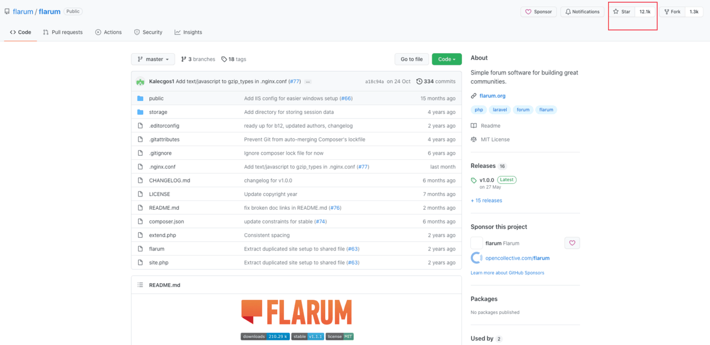

flarum在github有12K star,  由PHP编写，非常轻量


使用mariadb数据库（Mysql的分支），不吃内存；

中文社区也非常活跃


于是zhaoolee把flarum 部署到了树莓派，并通过内网穿透开放到公网，并绑定了独立的域名~


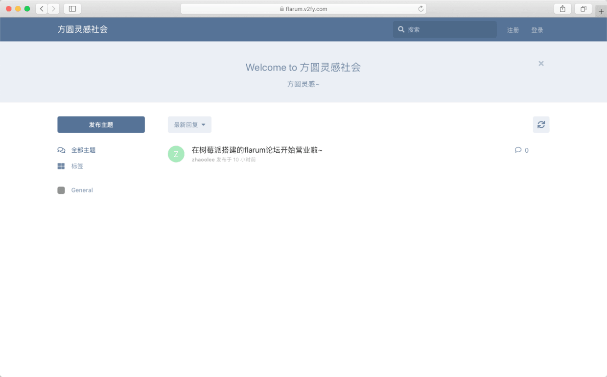


以下是详细的部署步骤~

## 以Docker形式往树莓派安装Mysql的分支 mariadb

- 新建配置文件

```
mkdir /opt/docker-mariadb
cd /opt/docker-mariadb
touch stack.yml
```
- 运行以下代码，往配置文件中写入内容, 以下配置文件登录的默认用户名为root, 默认密码为zhaoolee（为了安全将**MYSQL_ROOT_PASSWORD** 中的zhaoolee替换为自己定义的密码）
```
sudo cat >/opt/docker-mariadb/stack.yml<<EOF
version: '3.1'

services:

  db:
    image: mariadb
    restart: always
    ports:
      - 3306:3306
    environment:
      MYSQL_ROOT_PASSWORD: zhaoolee

  adminer:
    image: adminer
    restart: always
    ports:
      - 8090:8080
EOF
```

- 启动mariadb服务

```
cd /opt/docker-mariadb/
sudo docker-compose -f stack.yml up -d
```

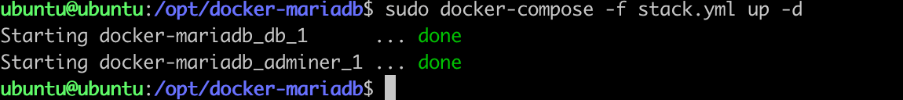

- 访问树莓派的8090端口

我的树莓派内网地址为192.168.50.223， 访问 192.168.50.223:8090即可


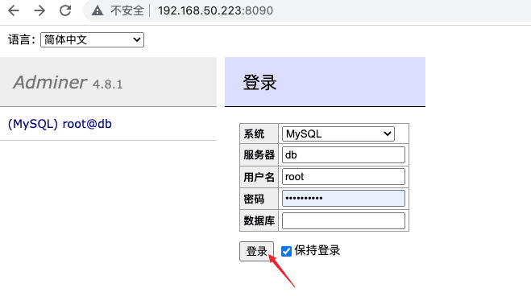

- 登录后

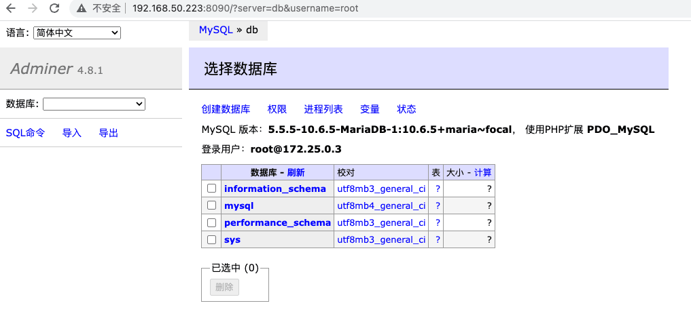

- 新建数据库

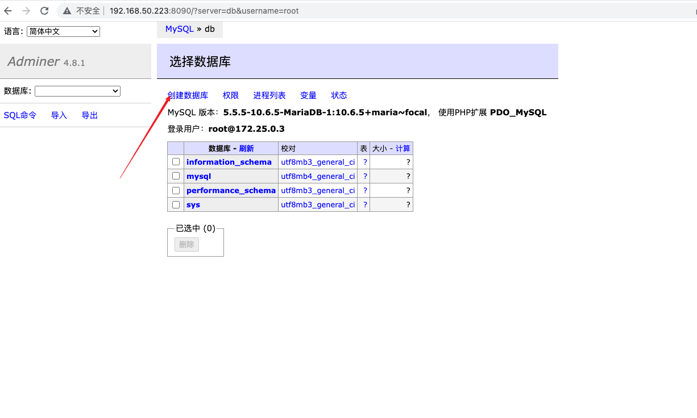

- 设置数据库编码并保存

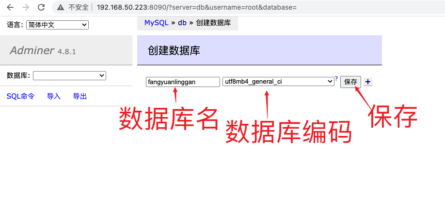

- 数据库创建成功

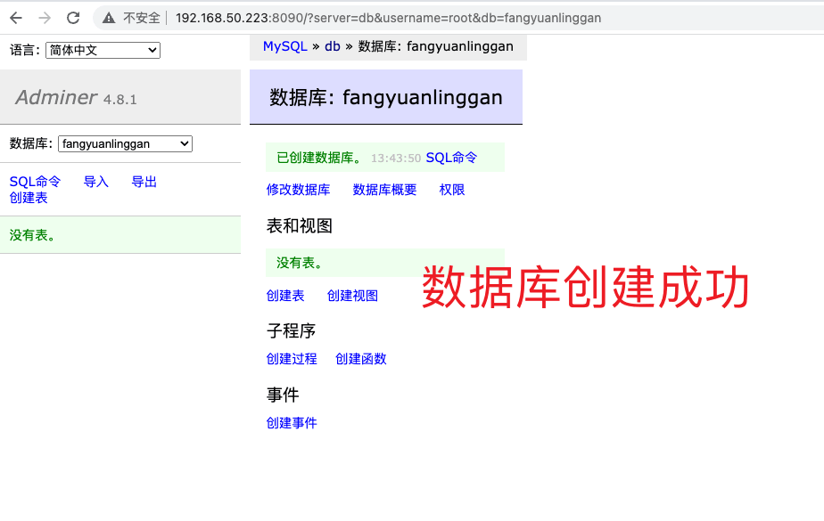


## 安装Nginx


```
sudo apt install nginx -y
which nginx
```
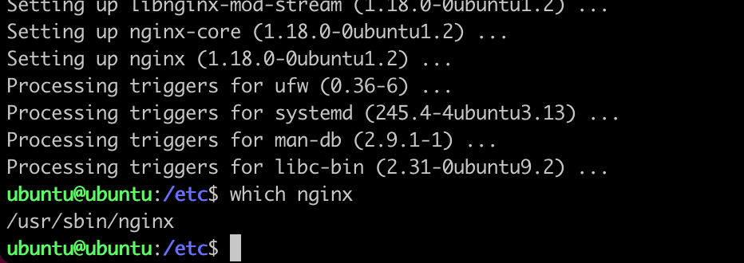

- 设置Nginx开机自启任务，开启nginx
```
sudo systemctl enable nginx
sudo systemctl start nginx
```

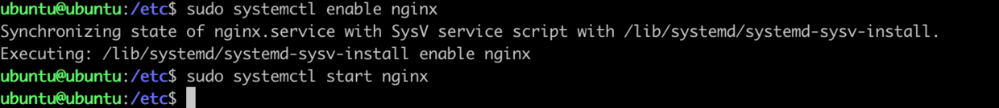

- 访问树莓派ip, 可以看到Nginx开启成功

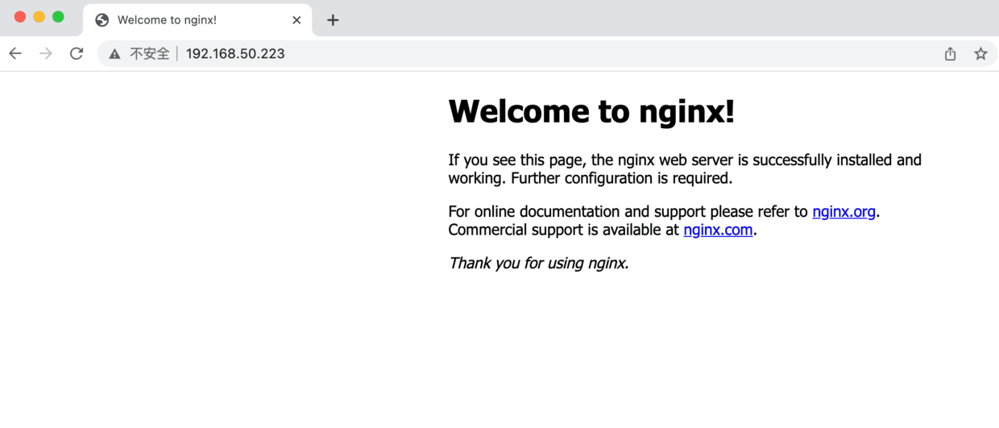


## 树莓派安装PHP7.3


```
sudo add-apt-repository ppa:ondrej/php
sudo apt-get update
```

```
sudo apt-get install php7.3 -y
sudo apt-get install php7.3-fpm -y
```
- 查看PHP版本

```
php -v
```

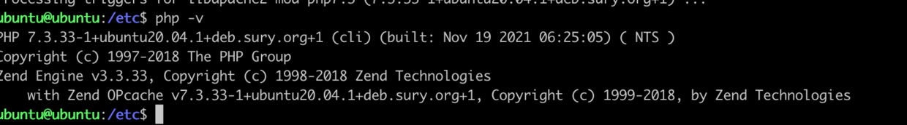


- 查看php7.3-fpm的位置

```
dpkg -S php7.3-fpm
```

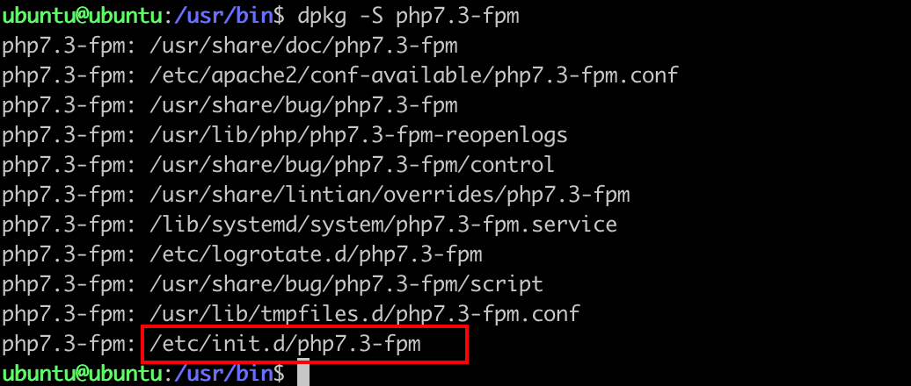


- 修改 `/etc/php/7.3/fpm/php.ini`
```
# 替换:
;cgi.fix_pathinfo=1
# 为:
cgi.fix_pathinfo=0
```

- 重载php7.3-fpm, 使配置生效
```
sudo /etc/init.d/php7.3-fpm reload
```

## 安装composer

```
cd /opt
mkdir composer
cd composer/
php -r "copy('https://getcomposer.org/installer', 'composer-setup.php');"
php -r "if (hash_file('sha384', 'composer-setup.php') === '906a84df04cea2aa72f40b5f787e49f22d4c2f19492ac310e8cba5b96ac8b64115ac402c8cd292b8a03482574915d1a8') { echo 'Installer verified'; } else { echo 'Installer corrupt'; unlink('composer-setup.php'); } echo PHP_EOL;"
php composer-setup.php
php -r "unlink('composer-setup.php');"

sudo mv composer.phar /usr/local/bin/composer
```
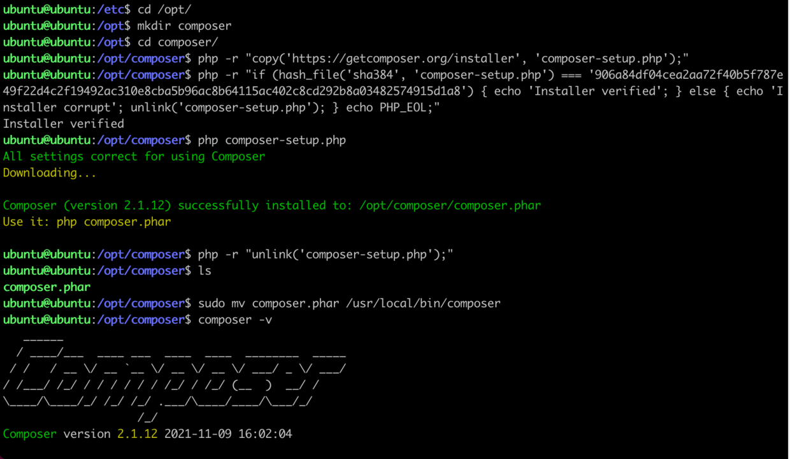


## 配置 flarum

```
sudo apt-get install php7.3-mbstring -y
```

-  php模块配置文件的位置

```
/etc/php/7.3/cli/php.ini
```

-  官方要求启用的模块 fileinfo, curl, dom, exif, gd, json, mbstring, openssl, pdo_mysql, tokenizer, zip


```
sudo apt-get install php7.3-fileinfo -y
sudo apt-get install php7.3-curl -y
sudo apt-get install php7.3-dom -y
sudo apt-get install php7.3-exif -y
sudo apt-get install php7.3-gd -y
sudo apt-get install php7.3-json -y
sudo apt-get install php7.3-mbstring -y
sudo apt-get install php7.3-tokenizer -y
sudo apt-get install php7.3-zip -y
sudo apt-get install php7.3-mysql
```

- 查看启用的模块

```
php -m
```

- 重启php7.3-fpm, 让模块生效

```
sudo /etc/init.d/php7.3-fpm restart
```
- 开始安装 flarum 及其依赖
```
cd /opt
mkdir flarum
cd flarum
composer create-project flarum/flarum . --stability=beta
composer install
```

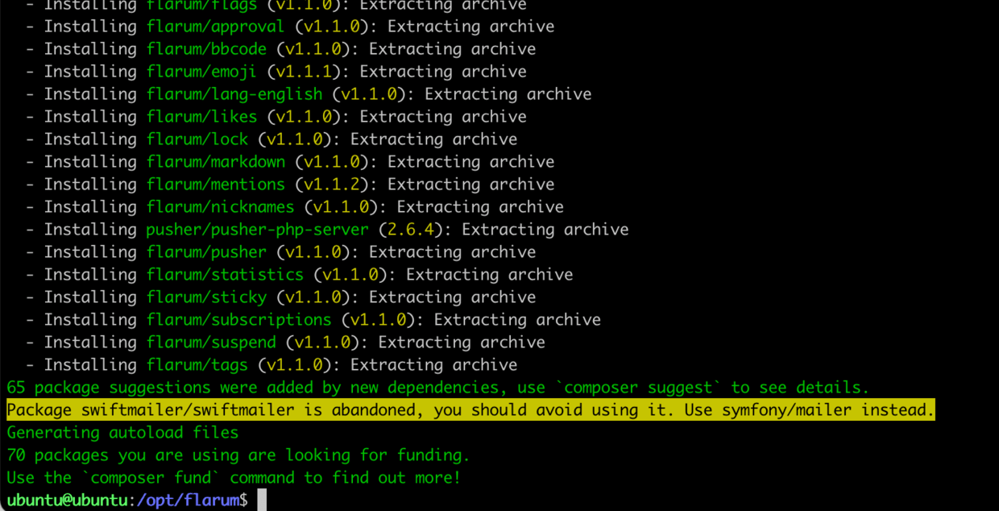

## 为nginx新增配置文件


```
sudo touch /etc/nginx/conf.d/flarum.v2fy.com.conf
sudo chmod 777 /etc/nginx/conf.d/flarum.v2fy.com.conf
```


- 在/etc/nginx/conf.d/flarum.v2fy.com.conf 中写入以下内容

```
server {
    listen 80;
    listen [::]:80;
    root /opt/flarum/public;
    index index.php index.html index.htm;
    server_name flarum.v2fy.com;
    
    location ~ \.php$ {
        include snippets/fastcgi-php.conf;
        fastcgi_pass unix:/run/php/php7.3-fpm.sock;
        fastcgi_param SCRIPT_FILENAME $document_root$fastcgi_script_name;
    }
    
    location ~ /\. {
        deny all;
    }
    
    location = /favicon.ico {
        log_not_found off;
        access_log off;
    }
    
    location = /robots.txt {
        log_not_found off;
        access_log off;
        allow all;
    }
    include /opt/flarum/.nginx.conf;
}
```

- 重启nginx


```
# 测试配置文件是否有语法错误
sudo nginx -t
# 重启Nginx
sudo nginx -s reload
```

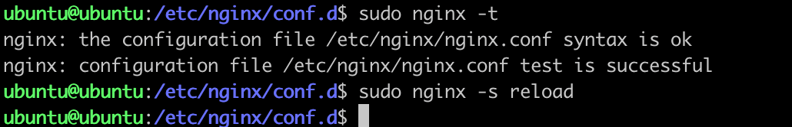

- 将目录设置为可写

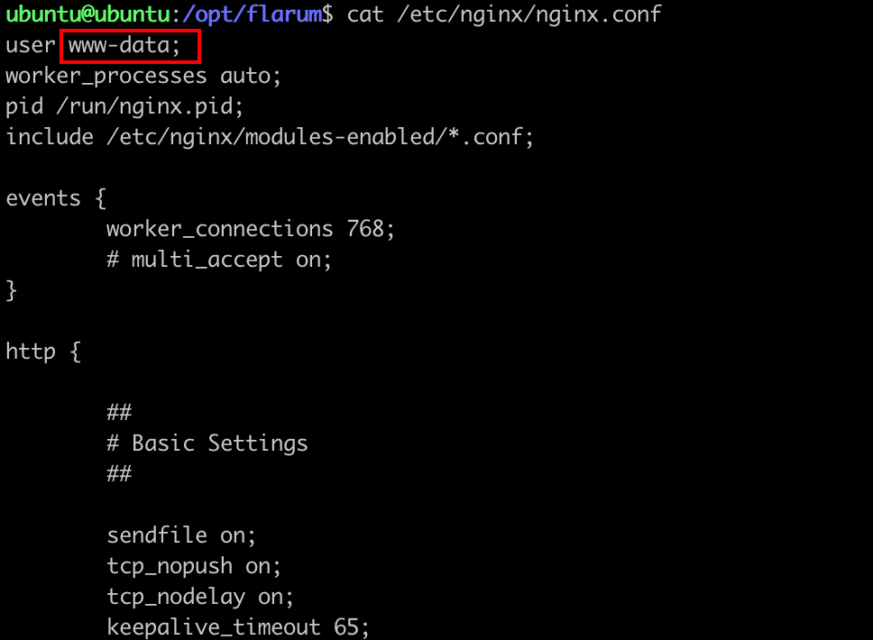


```
 sudo chown -R 777 /opt/flarum
```

## 通过改host将flarum.v2fy.com 指向 树莓派ip 192.168.50.233


浏览器访问 flarum.v2fy.com

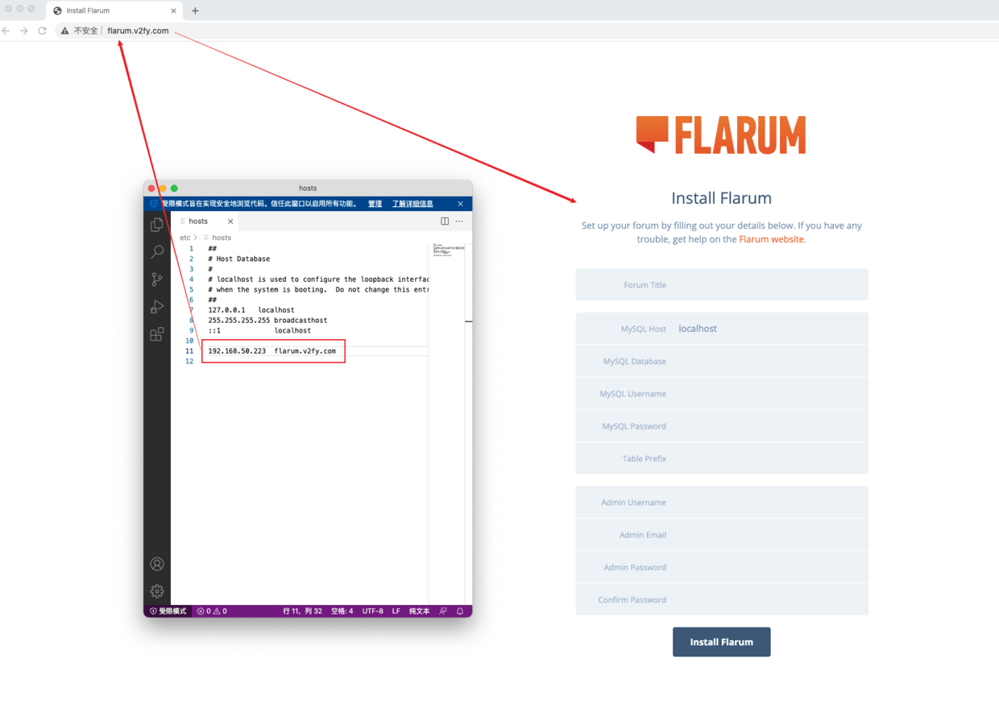


- 初始化网站


- 网站初始化成功


- 数据表完成了初始化


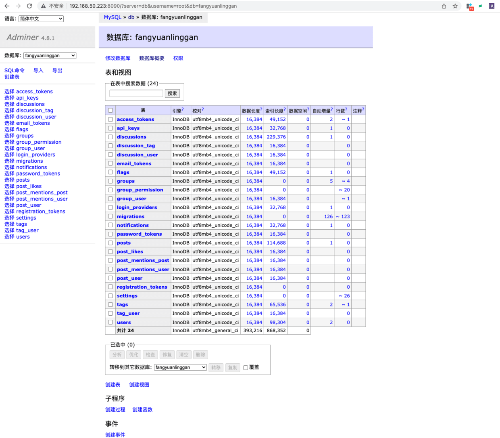


## 将树莓派服务通过内网穿透转发到真正的flarum.v2fy.com

阅读本段落之前，请先理解frp内网穿透的相关知识，frp已经在本系列第一节写过教程 [《树莓派不吃灰》刷Ubuntu Server 20.04，绑定公网域名，对公网提供http服务，SSH登录服务 https://v2fy.com/p/2021-10-01-pi-server-1633066843000/](https://v2fy.com/p/2021-10-01-pi-server-1633066843000/)


- 第一步：树莓派端通过frp客户端, 将nginx提供服务的80端口，转发到拥有固定ip服务器的8666端口


也就是在`/opt/frp_0.37.0_linux_arm64/frpc.ini`中添加以下配置
```
[nginx-v2fy-com-8666]
type = tcp
local_ip = 127.0.0.1
local_port = 80
remote_port = 8666
```

配置完成后，记得重启frpc

- 第二步：登录服务端完成配置

我们可以通过 `lsof -i:8666` 看到服务端端口8666已经被frps占据了


将域名flarum.v2fy.com解析到 服务端ip

新建 `/etc/nginx/conf.d/flarum.v2fy.com.conf`

按照教程 [零依赖!使用acme.sh设置nginx多个https证书自动更新，无限续期https证书 https://v2fy.com/p/2021-06-27-nginx-https-1624774964000/](https://v2fy.com/p/2021-06-27-nginx-https-1624774964000/) 获得无限续期的https证书

- 最后`/etc/nginx/conf.d/flarum.v2fy.com.conf` 的内容为

```
upstream flarum_v2fy_com { server 127.0.0.1:8666; }

server {
    server_name      flarum.v2fy.com;
    listen           80;

    rewrite ^(.*)$ https://$host$1 permanent;

}


server {

    listen       443 ssl http2;
    listen       [::]:443 ssl http2;
    server_name  flarum.v2fy.com;

    location / {
        proxy_pass http://flarum_v2fy_com;
        proxy_set_header Host $host:443;
        proxy_set_header X-Real-IP $remote_addr;
        proxy_set_header X-Forwarded-For $proxy_add_x_forwarded_for;
    }

    ssl_certificate "/etc/nginx/ssl/flarum.v2fy.com/fullchain.cer";
    ssl_certificate_key "/etc/nginx/ssl/flarum.v2fy.com/flarum.v2fy.com.key";
    ssl_session_cache shared:SSL:1m;
    ssl_session_timeout  10m;
    ssl_ciphers HIGH:!aNULL:!MD5;
    ssl_prefer_server_ciphers on;

    # Load configuration files for the default server block.

    error_page 404 /404.html;
        location = /40x.html {
    }

    error_page 500 502 503 504 /50x.html;
        location = /50x.html {
    }
}
```

- 测试并重启nginx
```
nginx -t
nginx -s reload
```

- 回到树莓派，让flarum配置文件适配https

打开`/opt/flarum/config.php` 将url字段改为以`//`开头

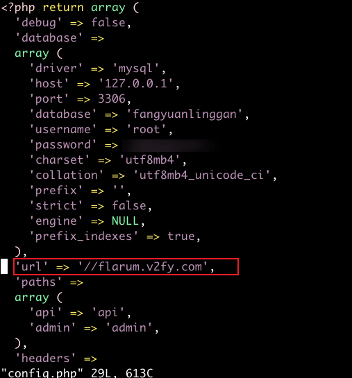

保存文件后，重启php7.3-fpm

```
sudo /etc/init.d/php7.3-fpm restart
```

我们将前面配置的host  信息`192.168.50.233 flarum.v2fy.com` 移除

用浏览器打开https://flarum.v2fy.com ,打开开发者工具
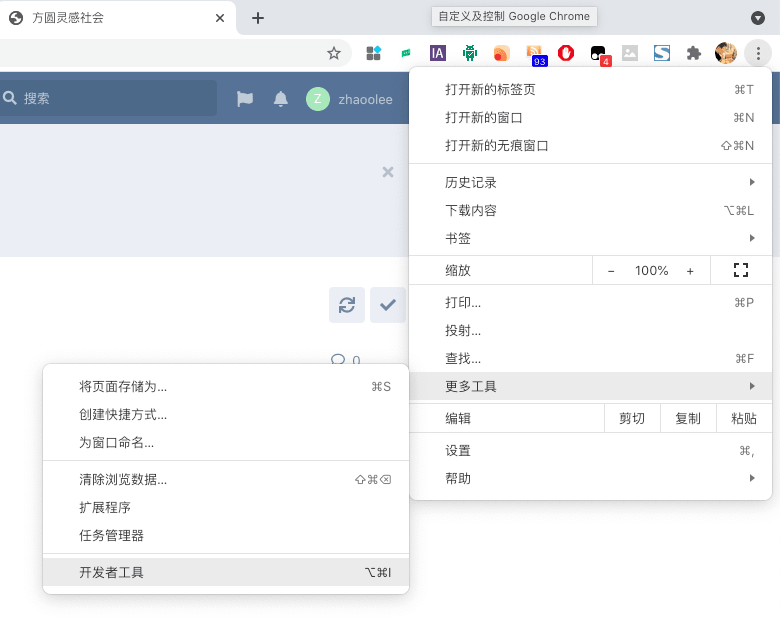

刷新页面，可以看到https://flarum.v2fy.com 来自公网服务器ip

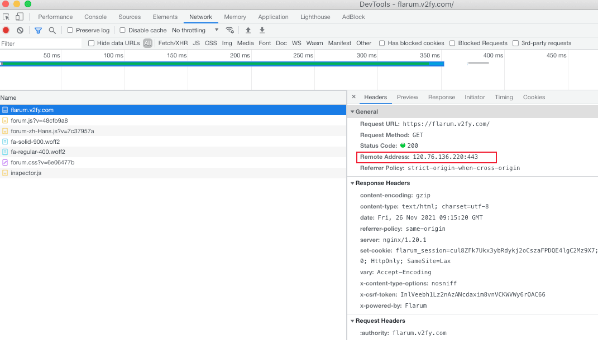

至此树莓派端的flarum转发到公网成功！

## 支持中文

- 添加中文语言包

```
composer require flarum-lang/chinese-simplified
```


- 启用中文包

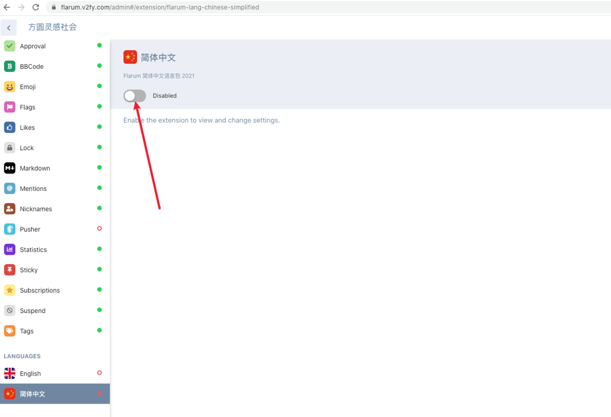

- 可以切换中英文了

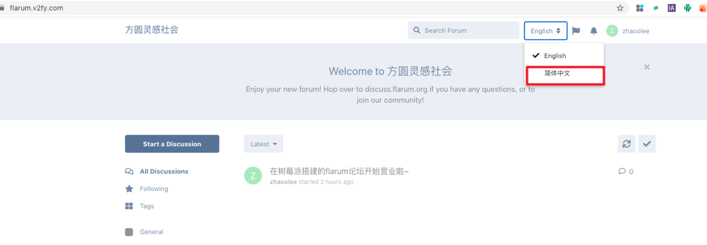

- 汉化完成

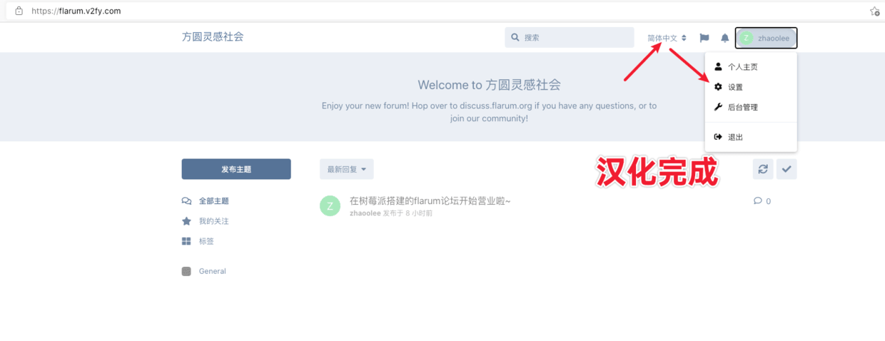

## 设置邮箱

我用的腾讯企业邮， 设置如下

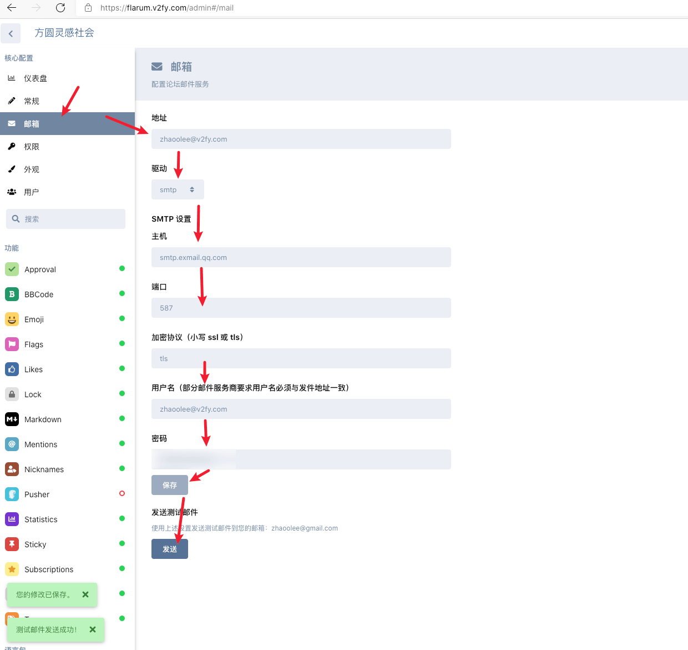

- 顺利收到了邮件

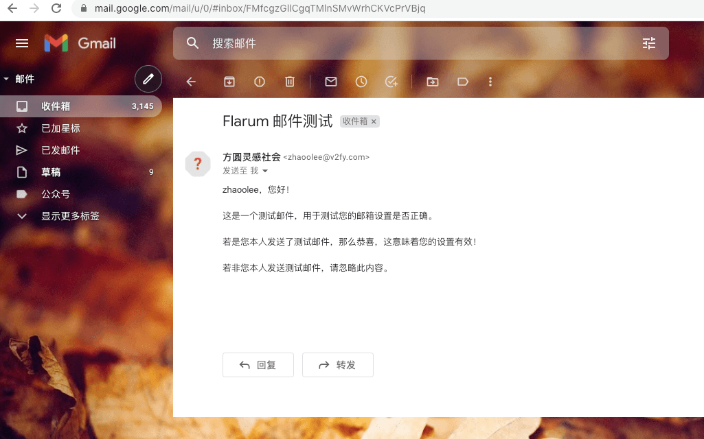


至此，一个基于flarum的树莓派BBS站配置成功！

- 手机端

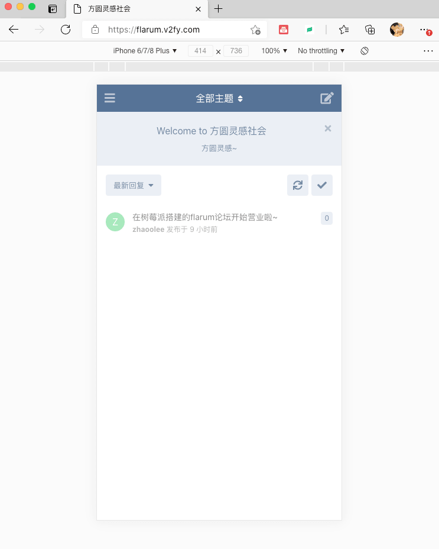

- PC端

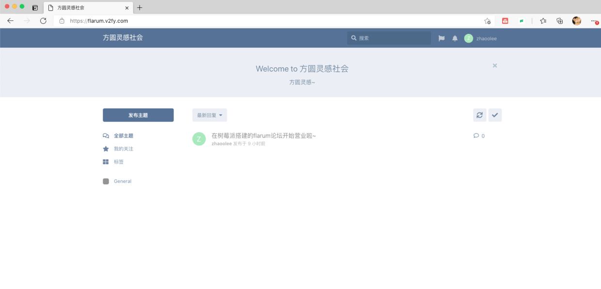

感兴趣的可以来 https://flarum.v2fy.com 注册用户


## 小结

Flarum和Discourse和都是好的BBS建站程序，他们开源免费，好用且强大，Flarum 比Discourse更轻量，支持armv8的CPU, 配合树莓派外挂的硬盘，可以低成本存储大量的图片资源，可作为一个长期的BBS论坛网站来维护；

低成本建网站很重要，用爱发电不靠谱，不能让BBS站长们，花费大量的金钱去建站，又毫无回报，那样的BBS很难长久，这个树莓派建站教程，能让建站的成本极大降低，只需一块树莓派，挂载一个大硬盘，就能搞定大容量存储，和CPU内存的问题, 只要买个有公网ip的小服务器就能长久运行网站了~


最后放一段我曾在Discourse教程末尾写的话

```
这个教程，希望能给需要建立社区的小伙伴一些帮助。
知乎，百度贴吧，微博，公众号这些平台推送的内容也是一言难尽， 甚至为了商业利益，频繁作恶。
如果可以发言的自建论坛很多，人们的发言也就更为自由, 世界主流的思想也就更为开发。
我希望2021年以后的世界，热心老哥越来越多，偏激主义思想越来越少。
```

欢迎来flarum.v2fy.com共同讨论树莓派建BBS站的相关问题~

