## BT和PT是什么，有什么区别？

BT（BitTorrent）和PT（Private Tracker）是两种常见的文件共享技术。


BT（BitTorrent）：你可以把BitTorrent想象成一个大型的拼图交换市场。假设你有一张非常大的拼图，你想要与他人分享。但是，它太大了，你不能一次性发送给别人。所以，你把它拆成了很多小块（这就是所谓的“分块”）。然后，你告诉大家：“嘿，我这有一张很酷的拼图，我已经把它分成了很多小块，你们可以来取。”这样，人们就可以从你那里取走一两块，然后再把它们分享给其他人。这样，拼图的各个部分就可以在网络中迅速传播开来。这就是BitTorrent的基本工作原理。


PT（Private Tracker）：PT就像是一个私人的拼图交换俱乐部。你需要得到邀请或满足一定的条件（例如，你需要证明你有分享拼图的意愿和能力）。在这个俱乐部里，拼图的交换是被严格跟踪的。如果你只是取走拼图的碎片，却不分享给其他人，那你可能会被踢出俱乐部。因此，PT通常能提供更高的下载速度和更高质量的文件，因为它的成员都有分享的动力。


## PT网站的魔力值是什么？

在PT（Private Tracker）网站上，**魔力值**是一种重要的度量标准，用于衡量用户的活跃度和贡献度。

PT希望成员尽可能多下载资源，下载资源后，尽可能长时间挂机做种，这样，其它其它成员下载资源时，就能获得较高的下载速度。

下载资源后，持续挂机做种，每小时都能收到魔力值奖励。


魔力值相当于PT网站的货币，可以用来悬赏资源，交易，兑换上传量（上传量和下载量要保持一定的比例，才能在PT站生存下来），邀请朋友入站等。


本文要达成的目标是创建一个qBittorrent Web版下载器，运行在家中的树莓派，支持公网访问添加下载任务，保持上传做种，用最低的用电成本，保持7x24小时在线，持续获取魔力值。

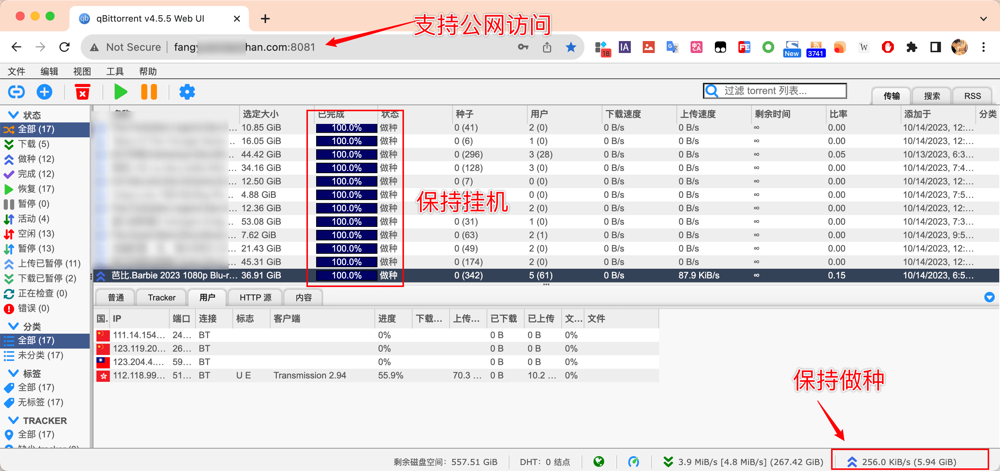


我们搭建的服务基于这个开源项目 https://github.com/linuxserver/docker-qbittorrent

## 创建服务

```
# 创建用于存储下载资源的文件夹（推荐将外接硬盘挂载到这个位置，有效提升提升树莓派的存储上限）
mkdir /opt/sda1
# 创建文件夹
mkdir /opt/server-qbittorrent
cd /opt/server-qbittorrent
# 创建用于存储配置的文件夹
mkdir /opt/server-qbittorrent/appdata
# 创建配置文件
touch /opt/server-qbittorrent/docker-compose.yml
```

将以下内容放入配置文件`docker-compose.yml`


```
---
version: "2.1"
services:
  qbittorrent:
    image: lscr.io/linuxserver/qbittorrent:latest
    container_name: qbittorrent
    environment:
      - PUID=1000
      - PGID=1000
      - TZ=Etc/UTC
      - WEBUI_PORT=8080
    volumes:
      - /opt/server-qbittorrent/appdata/config:/config
      - /opt/sda1/pt/downloads:/downloads
    ports:
      - 8080:8080
      - 6881:6881
      - 6881:6881/udp
    restart: unless-stopped
```

启动服务（请保持8080端口可用）


```
cd /opt/server-qbittorrent/
sudo docker-compose up -d
```

启动成功后，这个项目的web UI页面可以通过局域网IP:8080端口访问到,默认用户名为`admin`, 默认登录密码为`adminadmin`


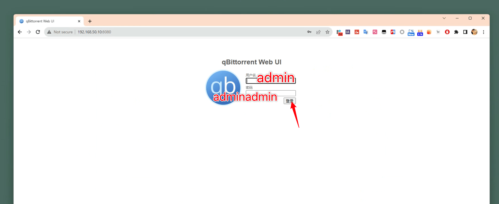

进入后可以修改显示语言，和登录用户名和密码，最后记得保存


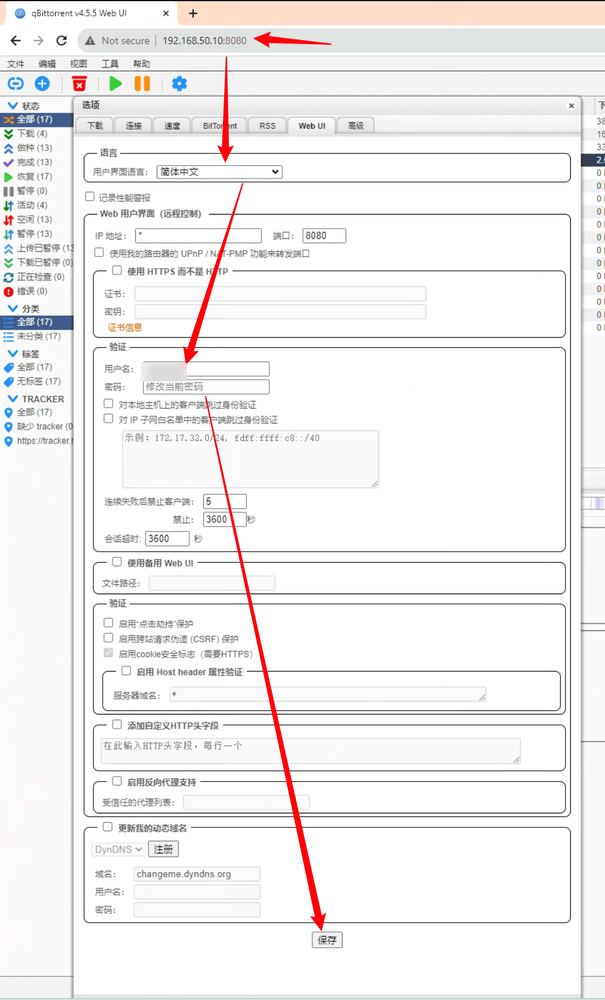


如果上传没速度，建议设置监听端口随机

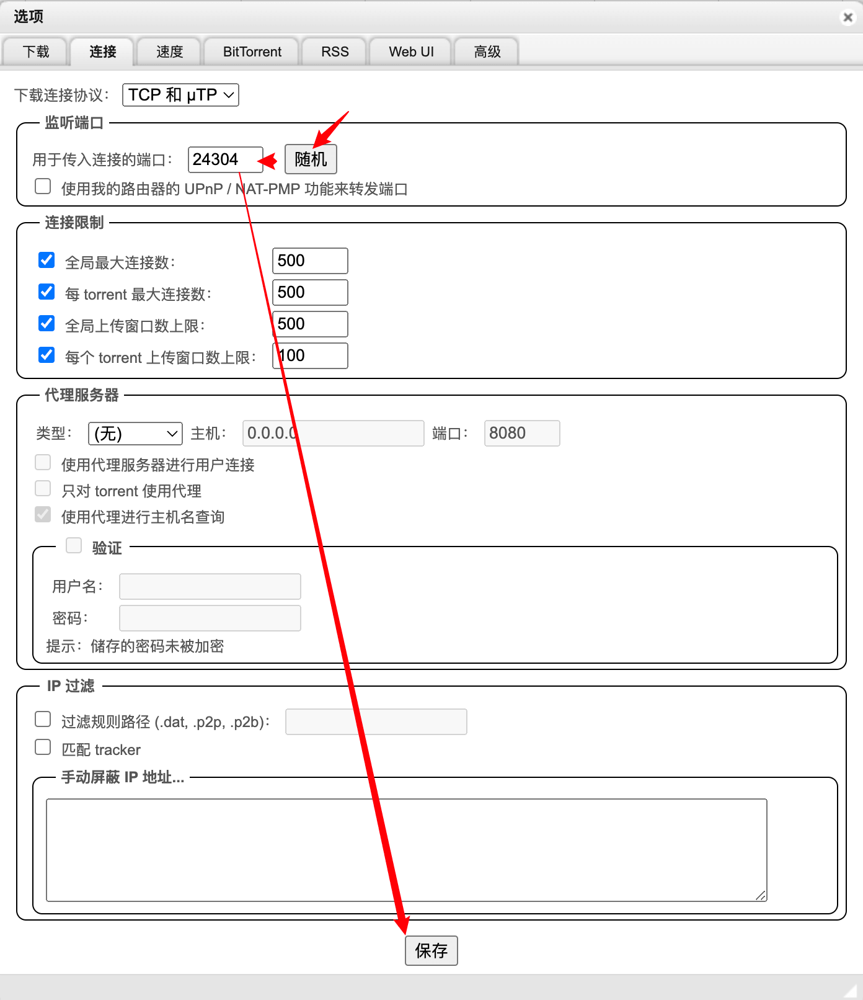


## 配置公网访问 / Configure public network access

在树莓派frpc.ini文件添加端口映射，将树莓派的8080端口映射到服务器8081端口实例配置


```
[qbit-8080]
type = tcp
local_ip = 127.0.0.1
local_port = 8080
remote_port = 8081
```

最后记得重启树莓派的frpc服务，服务器放行8081端口，公网可以通过Web访问，开始愉快做种，赚魔力值吧。


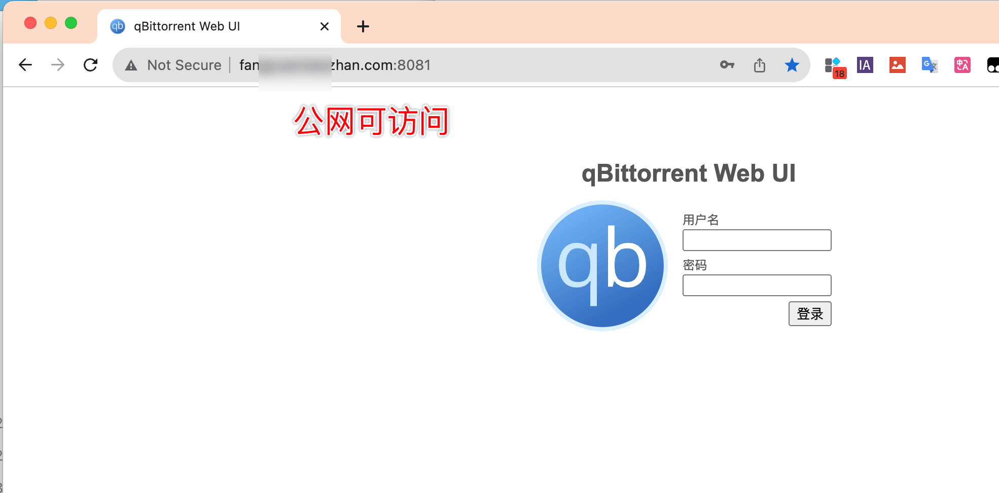


## 换更大的硬盘

经历了一周的下载，我发现1TB的硬盘很快就撑不住了。然后搞了个16TB硬盘


- 为树莓派挂载16TB硬盘，并支持开机自动挂载

首先，将16TB硬盘插入树莓派USB3.0插口，并已经安装了`e2fsprogs`这个包，它包含了`mkfs.ext4`这个命令

```bash
sudo apt-get update
sudo apt-get install e2fsprogs
```

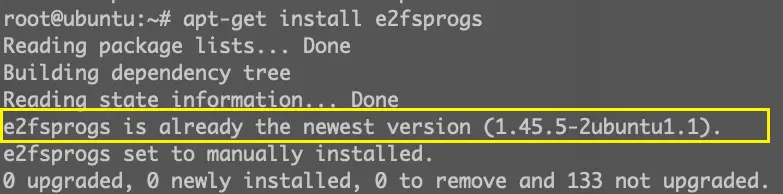


然后，可以使用`lsblk`或者`fdisk -l`命令来查看。设备名通常是类似于`sda`、`sdb`等, 我这里的硬盘设备名为`sdb`
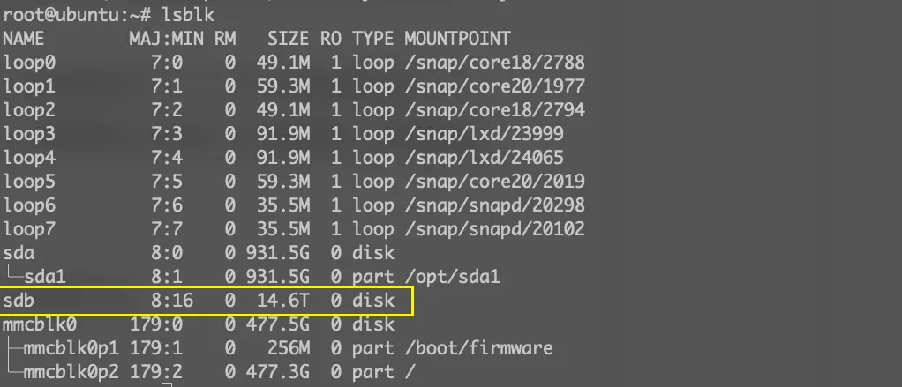


使用`mkfs.ext4`命令来格式化硬盘。注意，这将删除硬盘上的所有数据，所以请确保硬盘上没有你需要的数据。

```bash
sudo mkfs.ext4 /dev/sdb
```

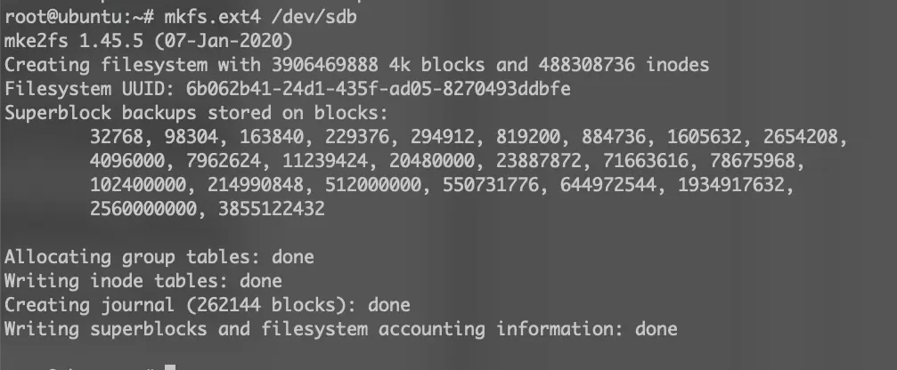


创建一个挂载点。我想要挂载到`/opt/sdb`，所以创建这个目录：

```bash
sudo mkdir /opt/sdb
```

挂载硬盘到这个目录：

```bash
sudo mount /dev/sdb /opt/sdb
```

为了开机自动挂载，需要编辑`/etc/fstab`文件。首先，获取硬盘的UUID：

```bash
sudo blkid
```

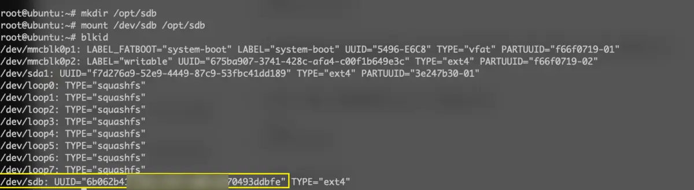


找到对应`/dev/sdb`的行，记下UUID。


使用你喜欢的文本编辑器编辑`/etc/fstab`文件。

```bash
sudo vim /etc/fstab
```

在文件的最后，添加一行如下：

```bash
UUID=6b062b4***************93ddbfe /opt/sdb ext4 defaults 0 0
```

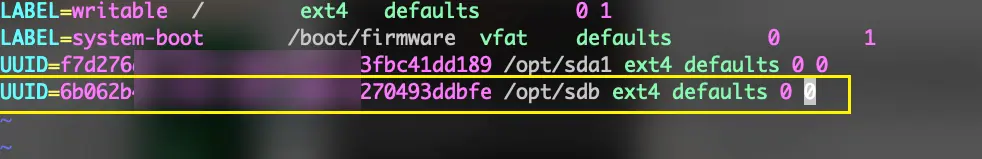


保存并退出。

最后，使用`mount -a`命令来挂载所有在`/etc/fstab`中定义的文件系统：

```bash
sudo mount -a
```

现在，硬盘应该已经格式化为ext4格式，并挂载到了`/opt/sdb`。并且，每次开机都会自动挂载。

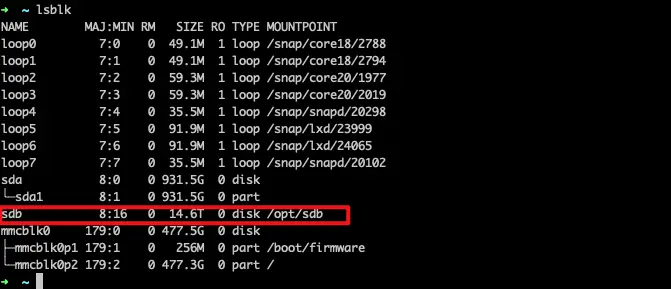


迁移数据也很简单，我的原硬盘挂载点为`/opt/sda1`，新硬盘挂载点为`/opt/sdb`，使用rsync 迁移，即使中途被中断也支持自动续传

```
rsync -ah --progress --delete /opt/sda1/pt/downloads/ /opt/sdb/pt/downloads
```

进入`/opt/server-qbittorrent`，运行以下命令关闭docker 服务

```
sudo docker-compose stop
```

修改配置文件`docker-compose.yml` 中`- /opt/sda1/pt/downloads:/downloads` 为 `- /opt/sdb/pt/downloads:/downloads`

启动docker 服务即可

```
sudo docker-compose up -d
```


树莓派的USB供电不是很充足，挂载多个机械硬盘容易供电不稳，导致挂载断掉，一般重启就能恢复挂载，建议使用独立供电的硬盘盒，并减少机械硬盘的挂载数量

## 一些更进阶的硬盘节省空间技巧

我们的16TB 硬盘可以作为smb服务的子目录，如果你阅读了本系列的第17期的jellyfin搭建教程，可以将16TB硬盘的smb挂载目录作为jellyfin的媒体库。

qBittorrent下载的内容可以直接在同一个硬盘硬链接到 Jellyfin媒体库文件夹，速度超快，而且硬链接后的文件只占用一份空间，就可以同时在qBittorrent 目录做种，在jellyfin目录生成海报墙；比如使用`cp -lR`从qbit下载目录创建硬链接到Jellyfin媒体库目录

```
cp -lR '/opt/sdb/pt/downloads/[六人行(老友记)].Friends Season 01-10 NTSC DD5.1 x264/Friends Season 01 NTSC DD5.1 x264-CtrlSD' '/opt/sdb/jellyfin/Shows/Friends (1994) [tmdbid-1668]/Season 1'
```

如果你感觉每次都要使用`cp -lR`麻烦，也可以在图形化界面直接复制拷贝两份，当磁盘空空快不够用时，使用`rdfind  -makehardlinks true /opt/sdb`  自动将相同文件进行去重，并生成硬链接，空间便又富裕起来。


## 一个方便PT玩家节省硬盘的硬链接脚本

https://github.com/zhaoolee/PTBoyHardLinkMedia


### 如何使用？

根据自己实际情况，设置PT下载的目录，已经影视库的目标目录

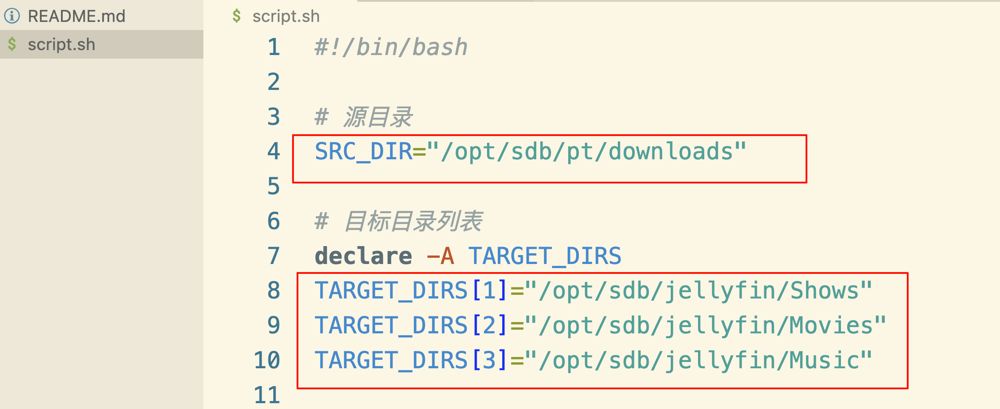

```
chmod +x script.sh

./script.sh
```


### 使用效果
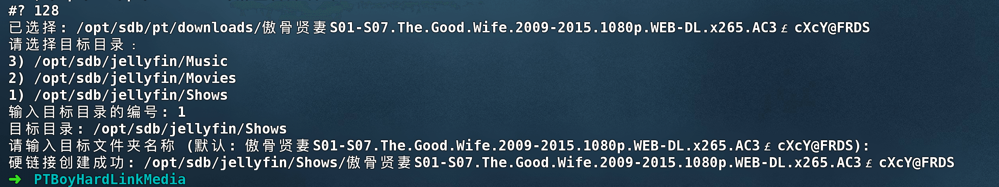

```
PTBoyHardLinkMedia ./script.sh
请选择要硬链接的文件夹：
...
128) /opt/sdb/pt/downloads/傲骨贤妻S01-S07.The.Good.Wife.2009-2015.1080p.WEB-DL.x265.AC3￡cXcY@FRDS
...
137) /opt/sdb/pt/downloads/庆余年.Joy.of.Life.2019.S01.WEB-DL.2160p.H265.AAC-ADWeb
138) /opt/sdb/pt/downloads/庆余年.Joy.of.Life.2024.S02.2160p.WEB-DL.H265.AAC-PTerWEB

#? 128
已选择: /opt/sdb/pt/downloads/傲骨贤妻S01-S07.The.Good.Wife.2009-2015.1080p.WEB-DL.x265.AC3￡cXcY@FRDS
请选择目标目录：
3) /opt/sdb/jellyfin/Music
2) /opt/sdb/jellyfin/Movies
1) /opt/sdb/jellyfin/Shows
输入目标目录的编号: 1
目标目录: /opt/sdb/jellyfin/Shows
请输入目标文件夹名称 (默认: 傲骨贤妻S01-S07.The.Good.Wife.2009-2015.1080p.WEB-DL.x265.AC3￡cXcY@FRDS): 
硬链接创建成功: /opt/sdb/jellyfin/Shows/傲骨贤妻S01-S07.The.Good.Wife.2009-2015.1080p.WEB-DL.x265.AC3￡cXcY@FRDS

```


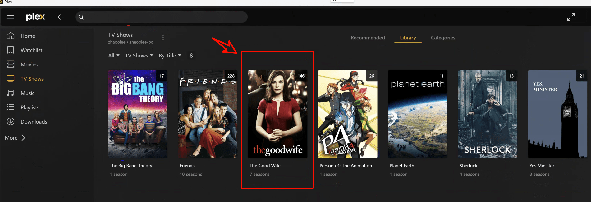


## 解决qBittorrent占用CPU过高的问题

我发现运行qbit后，树莓派的cpu占用经常飙到95%以上，我查阅了相关资料，最终在https://github.com/qbittorrent/qBittorrent/issues/13530 找到了解决方案，将原本默认值为10的`I/O threads`改为4即可

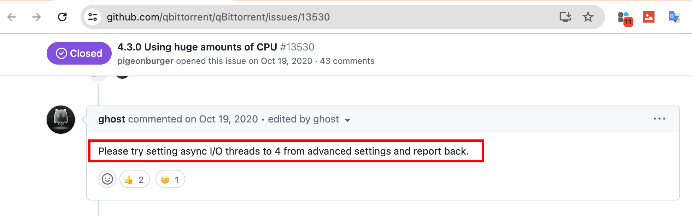

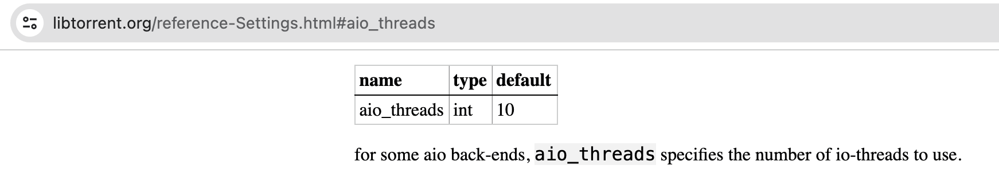


解决方案如下图所示，将 `Asynchronous I/O threads ` 改为4即可


修改完成后，记得保存

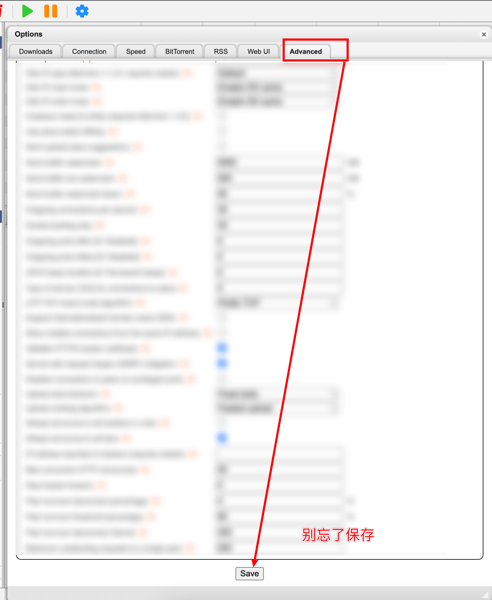

修改完成后，如果CPU依然占用高，可以尝试重启服务

```
cd /opt/server-qbittorrent
sudo docker-compose restart
```

修改完成后，虽然qit依然占用了大量CPU资源，但CPU负载保持在可接受范围内

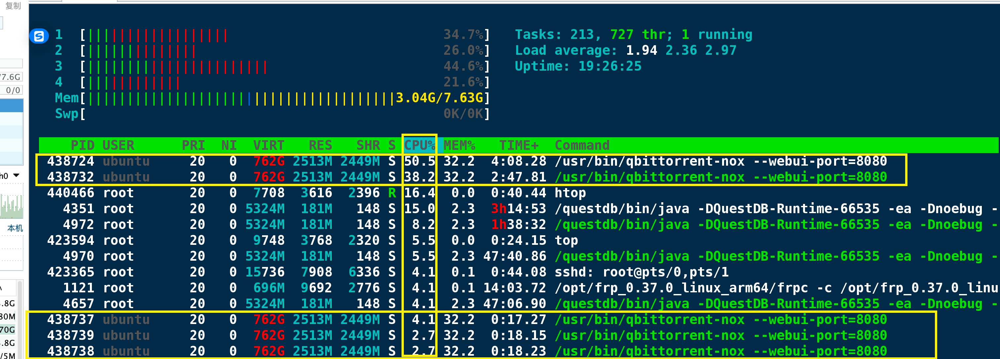

## 小结

BT是一项好技术，但吸血雷这种软件的存在，很多客户端只下载不上传，导致BT下载成了无源之水，无根之木。

而PT网站通过注册记名的方式，规范成员行为，通过魔力值货币量化的方式，让成员愿意使用qBittorrent这种遵守BT协议的软件长时间挂机，对于热爱高品质资源和高质量下载速度的成员来说，是一件好事。

人人为我，我为人人，应该是互联网精神的底色。
