最近有哥们推荐了一个现代化Linux开源管理面板1Panel，开源且稳定，懒是第一生产力，虽然命令行很灵活，但图形化界面真的是懒人刚需，本期在树莓派部署一下1Panel，让树莓派Linux运维更省力，进一步降低玩树莓派的门槛。开源地址：https://github.com/1Panel-dev/1Panel


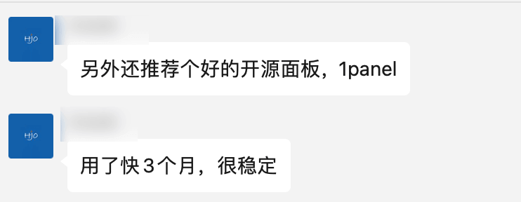

## 安装1Panel


```
curl -sSL https://resource.fit2cloud.com/1panel/package/quick_start.sh -o quick_start.sh && sudo bash quick_start.sh
```

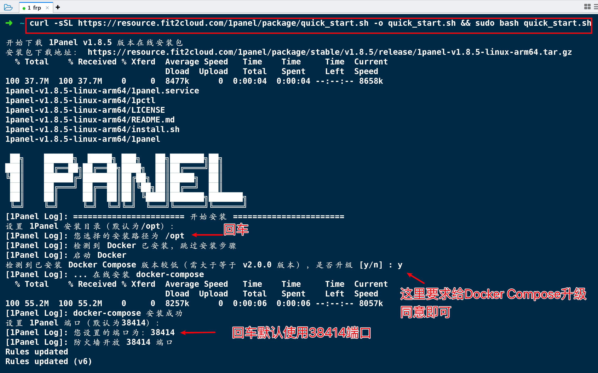

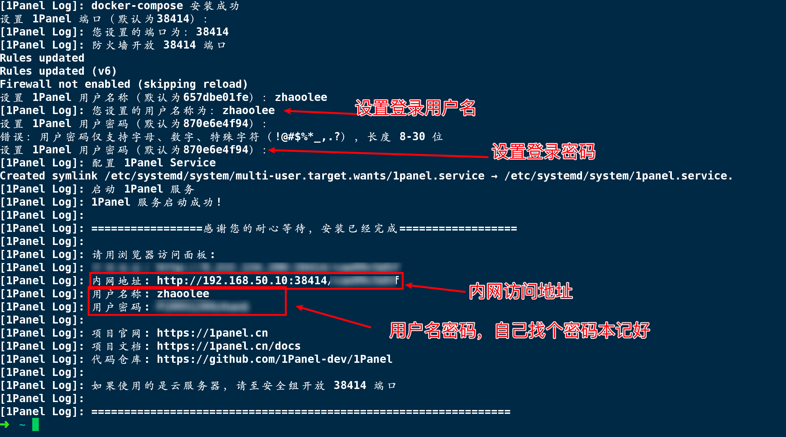

如果我们直接访问 38414 端口，会提示无权限，一定要访问完整的带路由的路径，如果忘了访问路径，在树莓派终端输入`1pctl user-info` 即可查看

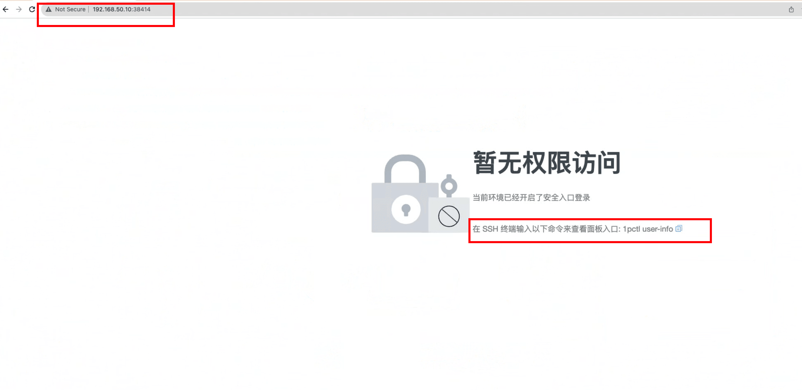

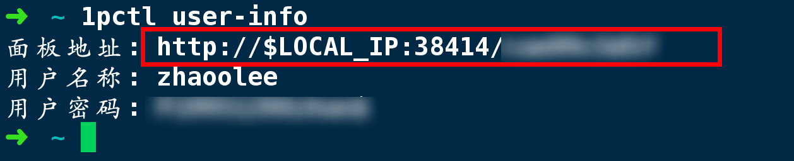

输入完整url, 输入用户名，密码，登录！

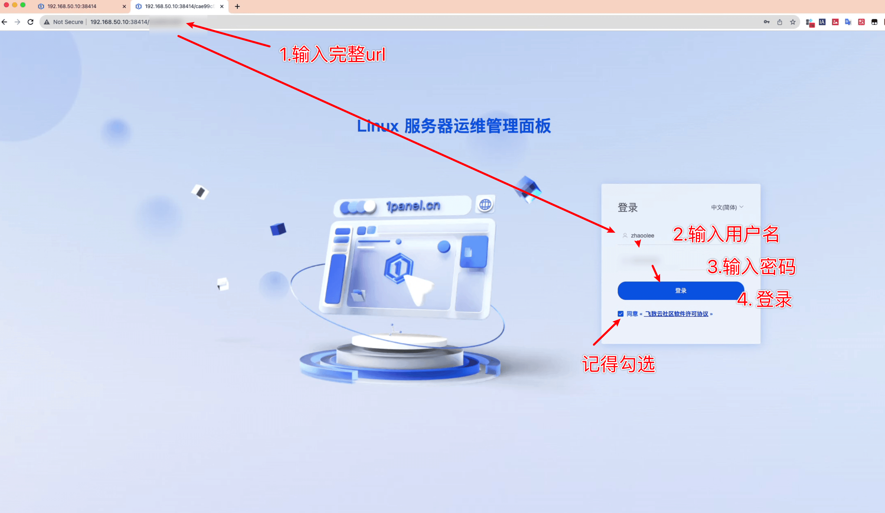

在首页我们可以看到树莓派当前的运行状态,以及系统的信息，CPU  90%的利用率，内存60%的利用率，树莓派被zhaoolee压榨的还是比较到位的，确实没有吃灰！（树莓派：我谢谢你！）

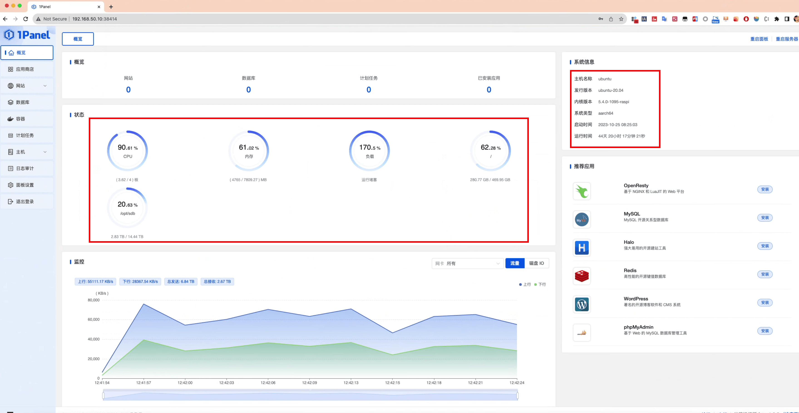

我们还可以通过容器菜单，查看各个Docker容器的运行情况

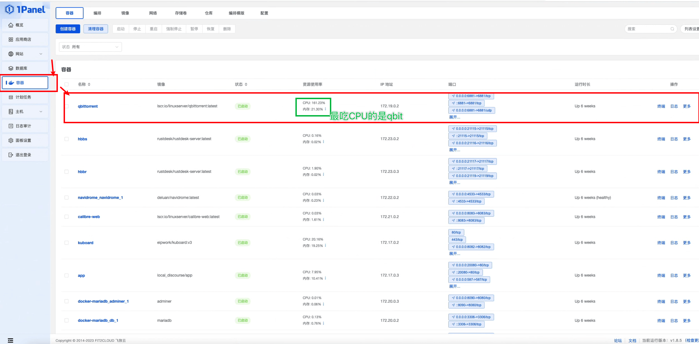


## 通过浏览器下载服务器文件到本地

我们可以直接通过浏览器下载树莓派的文件到本地


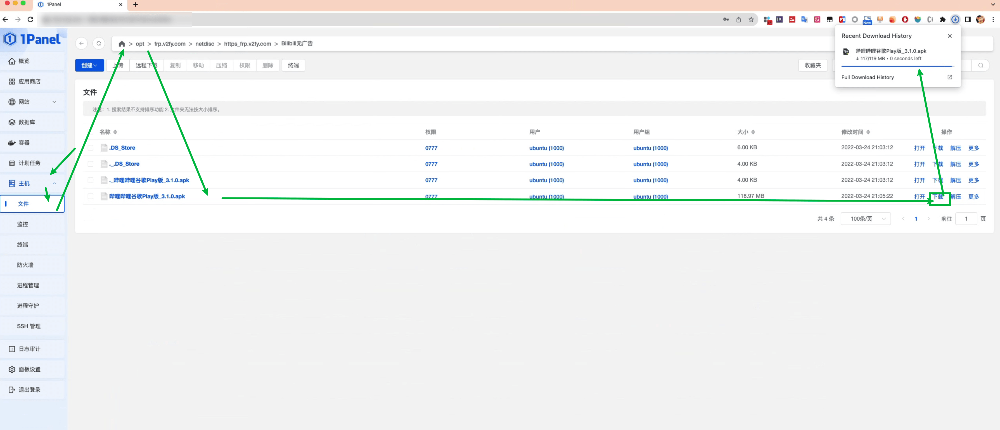

##  打开浏览器就可以使用ssh

我们可以通过浏览器直接使用终端命令行，操控树莓派

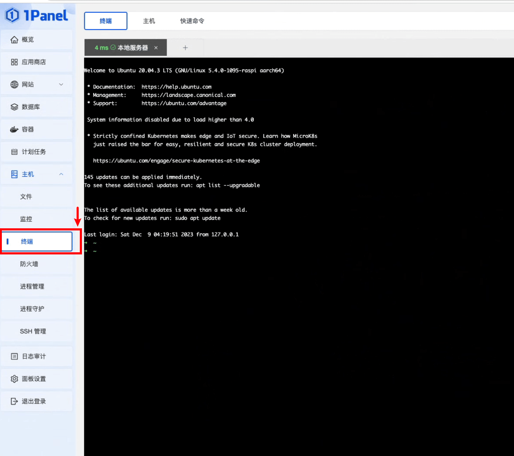


## 通过应用商店安装软件

1Panel还有一个非常方便的的功能，就是一键安装各种环境以及开源项目，这里我们演示安装一个网易云第三方客户端YouPlayMusic


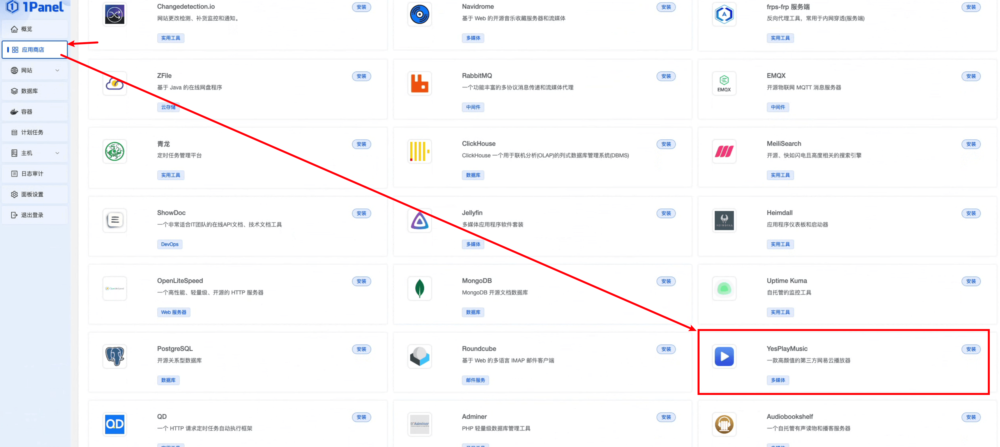

点击安装后，会有一个面板确认信息，为了方便演示，我们允许外部访问

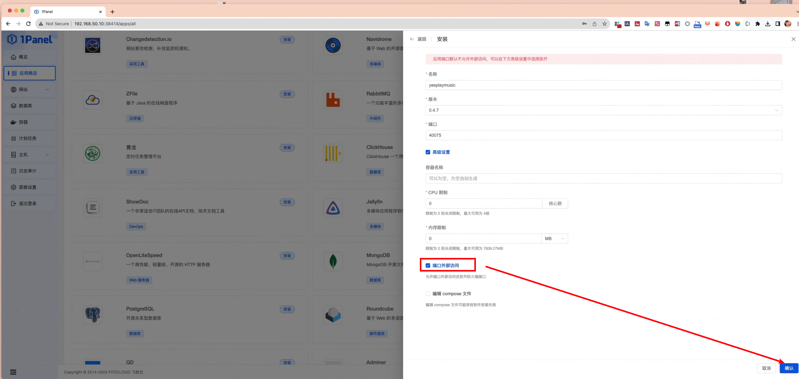

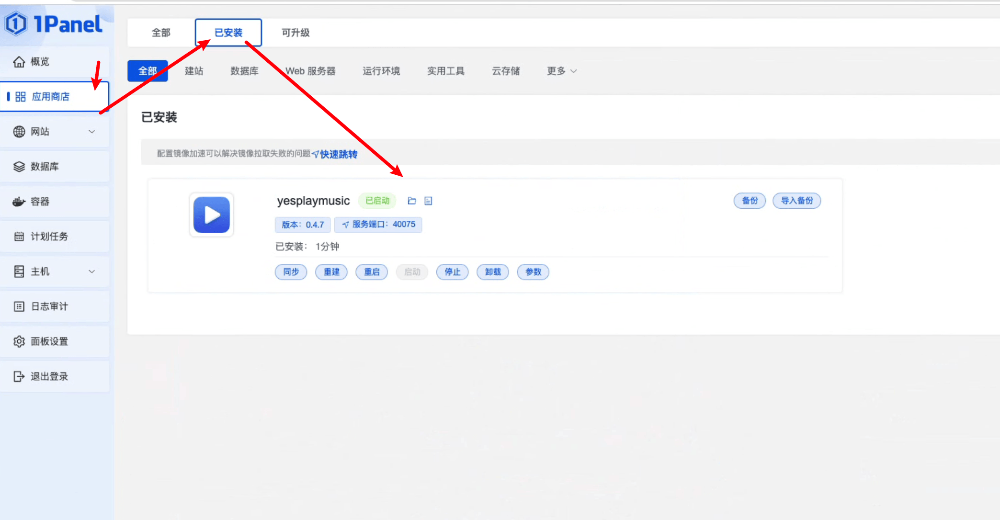

按照上图给出的提示，我们可以通过访问40075端口, 查看树莓派运行的yesplaymusic


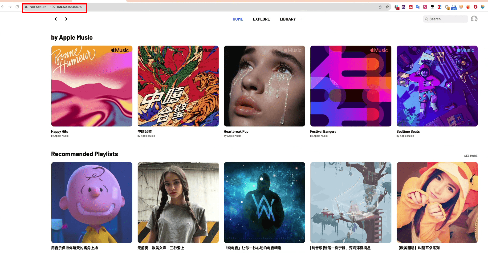


## 将1Panel映射到公网

如果你想在任何有互联网的地方都可以通过1Panel访问自己的树莓派，可以发挥传统艺能，通过frp将1Panel映射到公网，考虑到安全性，我会使用https加密，将 https://1panel.fangyuanxiaozhan.com/  的访问，转发到家庭树莓派的38414端口

首先在树莓派的 frpc.ini添加以下配置,重启树莓派的frpc服务，使其生效

```
[1panel-fangyuanxiaozhan-com-38414]
type = tcp
local_ip = 127.0.0.1
local_port = 38414
remote_port = 38414
```


然后在云服务器的nginx添加配置文件 `/etc/nignx/conf.d/1panel.fangyuanxiaozhan.com.conf`

```
upstream 1panel_fangyuanxiaozhan_com { server 127.0.0.1:38414; }

server {
  server_name      1panel.fangyuanxiaozhan.com;
  listen           80;

  location / {
    proxy_pass http://1panel_fangyuanxiaozhan_com;
    proxy_set_header Host $host:80;
    proxy_set_header X-Real-IP $remote_addr;
    proxy_set_header X-Forwarded-For $proxy_add_x_forwarded_for;
  }
}
```


## 通过acme申请证书

```
domain="1panel.fangyuanxiaozhan.com"
# 请求证书
acme.sh --issue -d $domain --nginx /etc/nginx/conf.d/$domain.conf
# 创建文件夹
mkdir -p /etc/nginx/ssl/$domain/
# 安装证书
acme.sh --install-cert -d $domain \
--key-file       /etc/nginx/ssl/$domain/$domain.key  \
--fullchain-file  /etc/nginx/ssl/$domain/fullchain.cer \
--reloadcmd     "service nginx force-reload"
```


将`/etc/nignx/conf.d/1panel.fangyuanxiaozhan.com.conf` 内容替换为以下内容

```
upstream 1panel_fangyuanxiaozhan_com { server 127.0.0.1:38414; }

server {
    server_name      1panel.fangyuanxiaozhan.com;
    listen           80;

    rewrite ^(.*)$ https://$host$1 permanent;

}

server {
    listen       443 ssl http2;
    listen       [::]:443 ssl http2;
    server_name  1panel.fangyuanxiaozhan.com;

    location / {
        proxy_pass http://1panel_fangyuanxiaozhan_com;
        proxy_set_header Host $host:443;
        proxy_set_header X-Real-IP $remote_addr;
        proxy_set_header X-Forwarded-For $proxy_add_x_forwarded_for;
    }

    ssl_certificate "/etc/nginx/ssl/1panel.fangyuanxiaozhan.com/fullchain.cer";
    ssl_certificate_key "/etc/nginx/ssl/1panel.fangyuanxiaozhan.com/1panel.fangyuanxiaozhan.com.key";
    ssl_session_cache shared:SSL:1m;
    ssl_session_timeout  10m;
    ssl_ciphers HIGH:!aNULL:!MD5;
    ssl_prefer_server_ciphers on;

    # Load configuration files for the default server block.

    error_page 404 /404.html;
        location = /40x.html {
    }

    error_page 500 502 503 504 /50x.html;
        location = /50x.html {
    }
}
```
最后,重启服务端nginx
```
nginx -s reload
```

在公网通过浏览器访问1panel


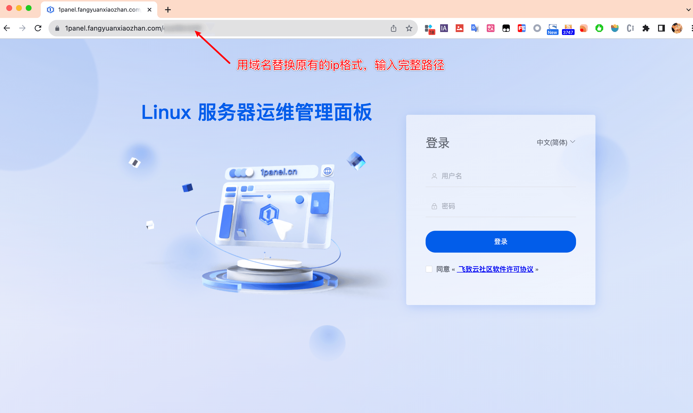


通过公网https登录访问树莓派1panel成功


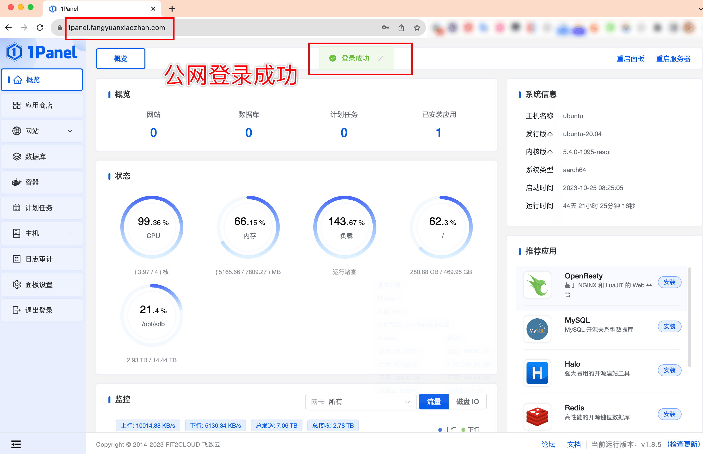

手机版也有较好的观感


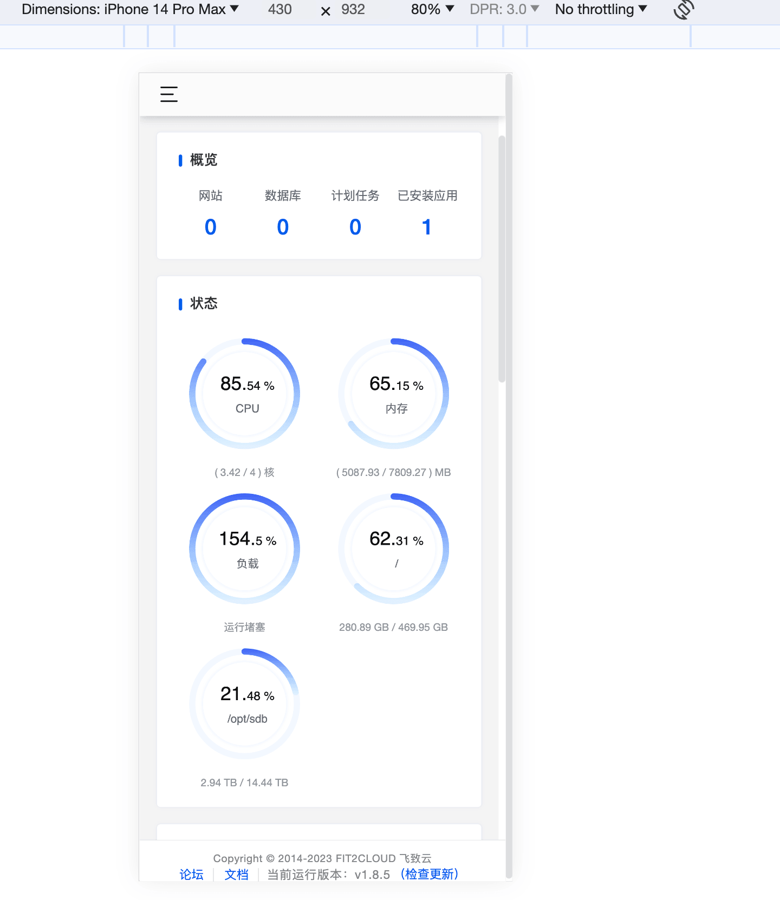

## 小结


如果你想时刻关注树莓派的运行情况，1Panel是个很好的选择，开源免费，充分利用Docker的特性，一键配置各种环境，安装各种软件。

《树莓派不吃灰》系列开源地址 github.com/zhaoolee/pi

