最近在玩Fooocus作图，作图是真的精美!  为了能在不同电脑间快速共享模型文件，我需要一个基于P2P的大文件传输工具。P2P可以用ZeroTier实现，ZeroTier私有化部署教程可参考 ` 《树莓派不吃灰》第二十六期：局域网开黑神器，使用Zerotier组建虚拟局域网，使用P2P技术为树莓派异地SMB下载超级加速 https://v2fy.com/p/2024-01-25-12-03-49-zerotier/ `，FileBrowser可以通过ZeroTier的内网虚拟IP，直接通过浏览器管理各种电脑上的文件。

本文的内容为在树莓派部署FileBrowser服务，以及在Windows部署FileBrowser的多盘符挂载技巧。

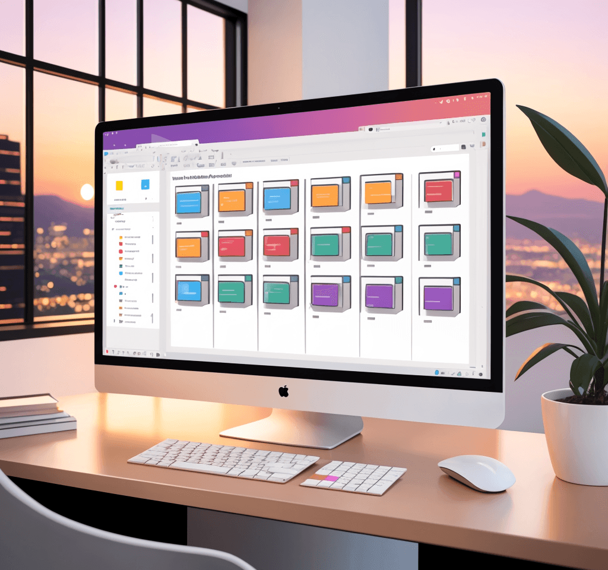


## 在树莓派部署FileBrowser服务


```
cd /opt/
mkdir FileBrowser
cd FileBrowser
curl -fsSL https://raw.githubusercontent.com/filebrowser/get/master/get.sh | bash

```

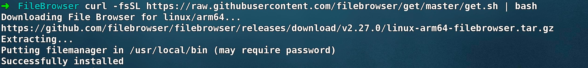

从返回的信息可知,  FileBrowser被放在 `/usr/local/bin` 目录下

接下来为FileBrowser创建一个配置文件`filebrowser.json` 并将运行端口设置为8083, 挂载根目录

```
touch /opt/FileBrowser/filebrowser.json


cat << 'EOF' > /opt/FileBrowser/filebrowser.json
{
  "port": 8083,
  "address": "0.0.0.0",
  "root": "/",
}
EOF
```

运行filebrowser


```
filebrowser -c /opt/FileBrowser/filebrowser.json
```

访问`http://树莓派被ZeroTier分配的ip:8083`即可! 


filebrowser默认的用户名为`admin`密码也是`admin`

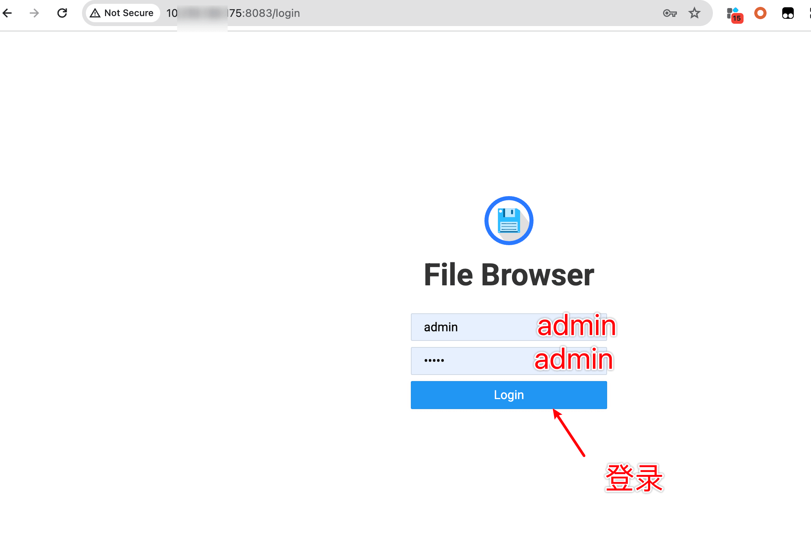


登录后即可看到树莓派的根目录，支持在网页拖拽上传和下载文件。

选中文件夹，也支持各种类型的打包下载


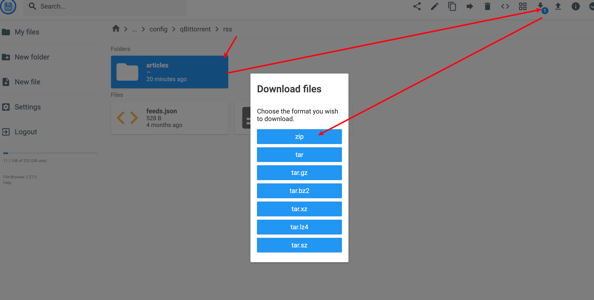

也可拖拽文件夹到网页直接上传，删除文件夹也是极其顺滑！


## 通过PM2守护filebrowser运行，设置filebrowser开机自启


```
# 创建启动脚本
touch /opt/FileBrowser/start-filebrowser.sh

# 在脚本内写入启动命令
cat << 'EOF' > /opt/FileBrowser/filebrowser.json
filebrowser -c /opt/FileBrowser/filebrowser.json
EOF

# 使用PM2启动脚本
pm2 start start-filebrowser.sh

# PM2保存记录
pm2 save
```

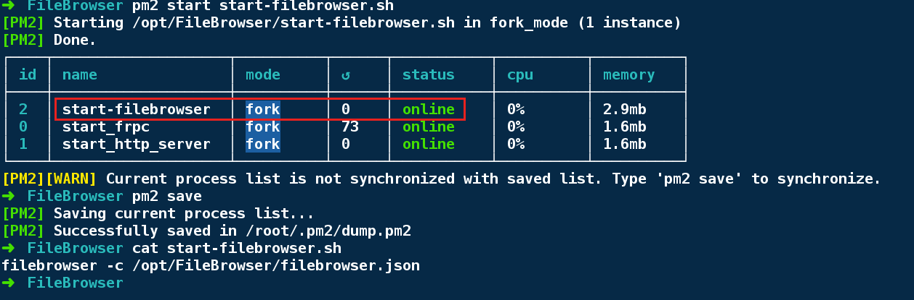

当看到start-filebrowser在PM2的Status为`online` , 则大功告成！


如果你需要通过filebrowser上传下载Windows内各盘符的文件，并支持Windows开机自启filebrowser，以下是一些闭坑指南


## 在Windows部署filebrowser闭坑全流程


以管理员身份启动Powershell

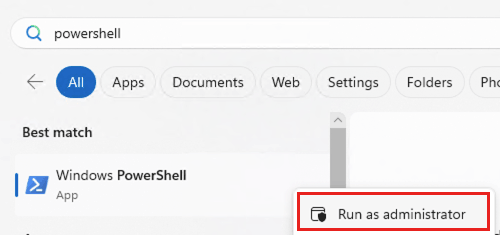


```
# 终端需要能魔法上网
curl -fsSL https://raw.githubusercontent.com/filebrowser/get/master/get.sh | bash
```

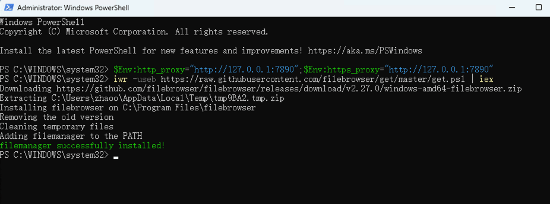


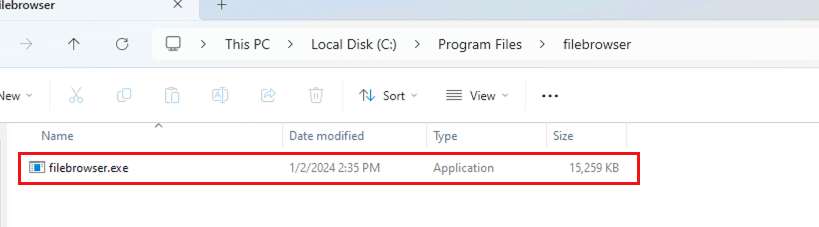


filebrower.exe被放在了文件夹 `C:\Program Files\filebrowser`  , 但是``C:\Program Files\filebrowser`` 目录的权限很严格，无论是修改配置文件，还是运行程序都很不方便，我建议将`filebrowser.exe`放到`D` `E` 等盘符下的某个文件夹内, 并将文件夹添加PATH变量

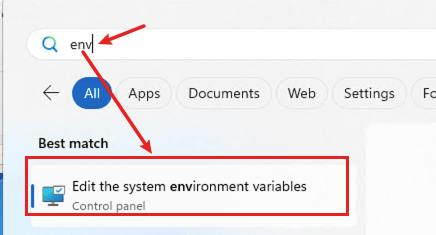

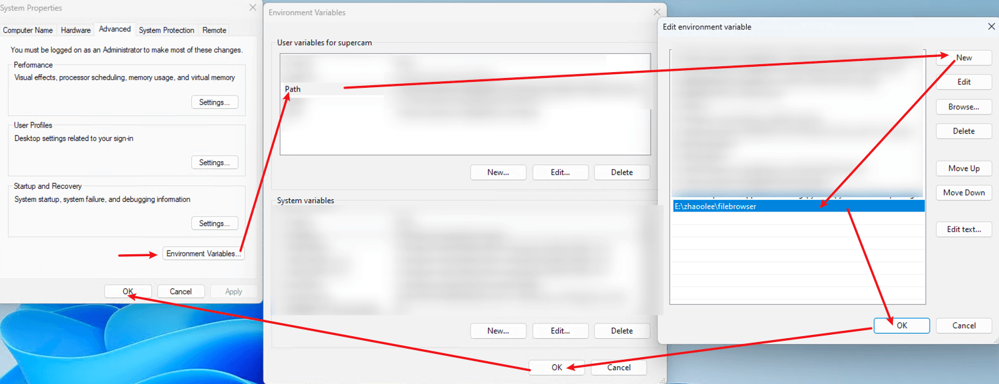


首先需要在Windows安装好Node.js,在Windows下安装PM2, 并设置PM2开机启动


```
npm install pm2 -g
npm install pm2-windows-startup -g
pm2-startup install
```

在filebrower.exe同级目录下，新建`filebrowser.json` , `start-filebrowser.config.js` ， `filebrowser.json` 中的内容与Linux版的配置格式一致即可，`start-filebrowser.config.js` 中的内容为

```
module.exports = {
  apps : [{
    name: 'filebrowser',
    script: 'E:/zhaoolee/filebrowser/filebrowser.exe',
    args: '-c \"E:/zhaoolee/filebrowser/filebrowser.json\"',
    exec_interpreter: 'none',
    exec_mode: 'fork'
  }]
};
```


打开cmd, 进入`filebrowser.exe` 所在目录，运行以下两行命令即可


```
pm2 start start-filebrowser.config.js
pm2 save
```


访问Windows的IP加端口号，即可访问 `filebrowser.exe` 所在目录的内容

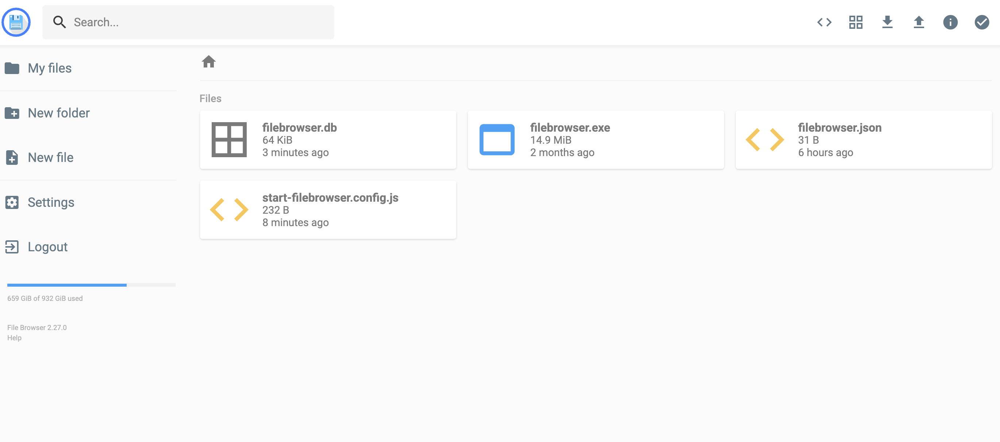


如果我们想将某台Windows电脑的 `C` `D` `E` 盘符显示在fileBrowser中

我们可以在以**管理员身份**启动**cmd**


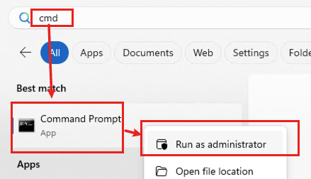

运行`mklink \D 目标文件夹 磁盘符号` 建立链接


```
# 进入一个文件夹，将文件夹路径配置为fileBrowser的root路径，然后建立文件夹映射
mklink /D .\C C:\
mklink /D .\D D:\
mklink /D .\E E:\
```


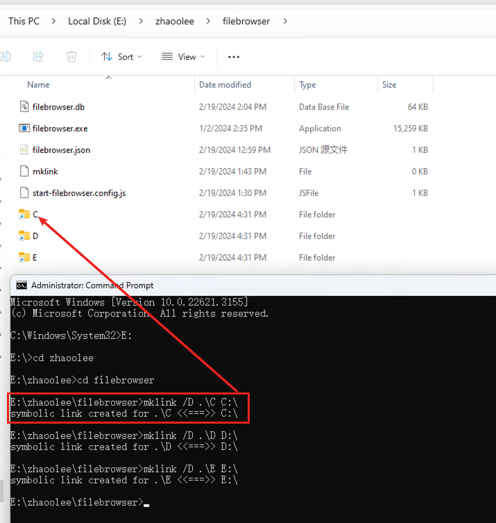

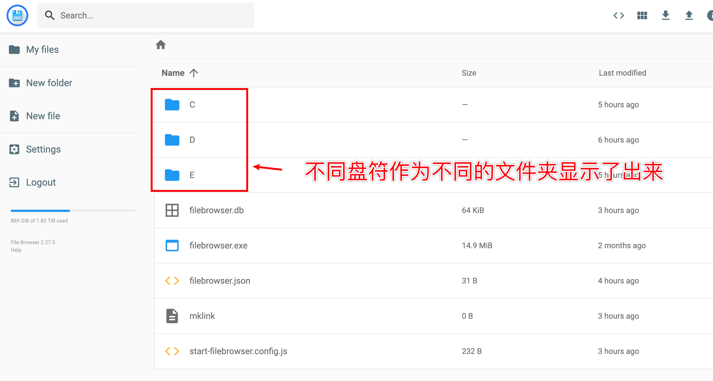


## 小结

FileBrowser以图形化界面的方式上传下载文件，对于不想敲命令的人而言，简直是懒人福音~ 

打开浏览器就能随时上传下载自己电脑的文件，保证数据安全的同时，配合Zerotier进行P2P传输，完全不限速。

将FileBrowser安装到Linux云服务器，相当于安装了一个支持文件管理的简易桌面。


