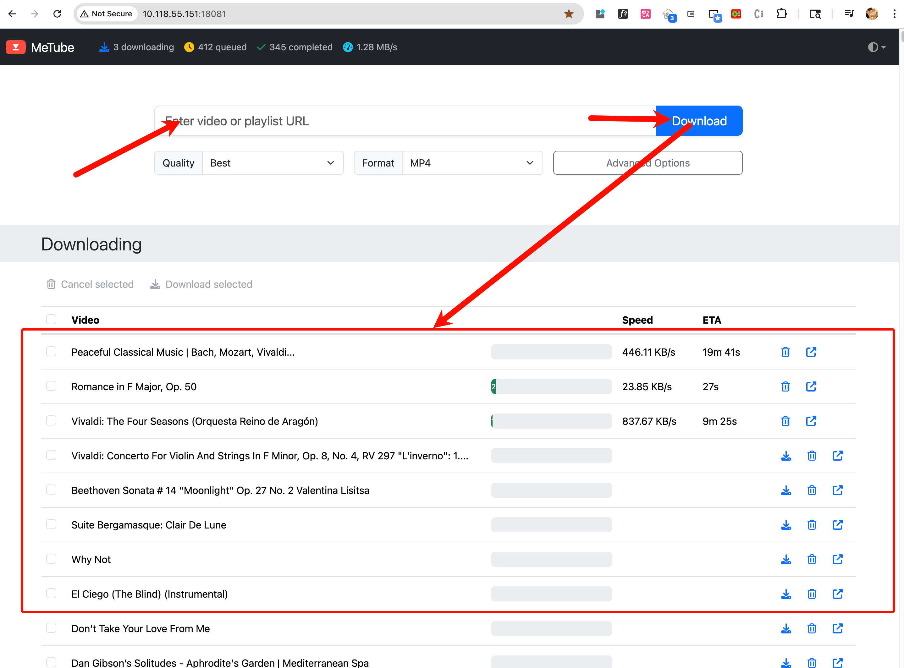

Youtube有大量的优质视频，但Youtube官方并没有提供下载到本地硬盘的方法，著名的开源项目https://github.com/yt-dlp/yt-dlp 可以让用户在命令行中下载视频，但是命令行对普通用户的学习成本还是太高了，于是Metube应运而生，Metube对yt-dlp进行了二次封装，提供一个网页，你只需在网页输入youtube的视频地址，Metube就可以帮你下载视频到本地硬盘。

下载视频这种事，是经典的需要长期开机的场景，超低功耗的树莓派恰好适合做这种事！

Metube的使用非常简单，可以docker一键启动，把下载目录指向到挂载到smb服务的局域网硬盘。

## 推荐的docker compose配置

```
services:
  metube:
    image: ghcr.io/alexta69/metube
    container_name: metube
    restart: unless-stopped
    ports:
      - "18081:8081"
    volumes:
      - /opt/homepi4b/opt/sdb/metube/downloads:/downloads
      - /var/lib/metube-state:/downloads/.metube   # ✅ 状态放在本机 ext4
      - /opt/metube/cookies:/cookies
    environment:
      - YTDL_OPTIONS={"cookiefile":"/cookies/cookies.txt"}
```

以上配置中`/opt/homepi4b/opt/sdb/metube/downloads` 是局域网smb的挂载类型`cifs`，如果类型不是ext4  , 则会导致 SQLite/shelve 在 `/downloads/.metube` 里建库就卡死!

```
➜  metube df -T /opt/homepi4b/opt/sdb/metube/downloads
Filesystem           Type   1K-blocks        Used  Available Use% Mounted on
//10.118.55.175/root cifs 15501595164 10906414784 4595180380  71% /opt/homepi4b
```

必须把`/downloads/.metube` 挂载到支持ext4的位置，并设置

```
# 准备本机状态目录（在系统盘 ext4 上）
sudo mkdir -p /var/lib/metube-state
sudo chown -R 1000:1000 /var/lib/metube-state

# 保险起见，再确认下载目录权限
sudo chown -R 1000:1000 /opt/homepi4b/opt/sdb/metube/downloads
```

## 获取cookie 

获取cookie可以参考 [《Get cookies.txt LOCALLY》 获取油管cookies，自动化下载油管视频](https://zhaoolee.com/ChromeAppHeroes/#/130-get-cookiestxt-locally.md) 

获取cookies是非常重要的一步，获取完抽请存储好cookies.txt文件，并挂载给Metube，否则大概率无法进行下载（Youtube防爬很苛刻）

```
➜  metube pwd    
/opt/metube
➜  metube tree
.
├── cookies
│   └── cookies.txt
└── docker-compose.yml

2 directories, 2 files

```

## 配置完成后,  启动容器

```
# 起容器
cd /opt/metube
sudo docker compose up -d
```

在浏览器打开树莓派的18081端口即可访问Metube，输入youtube视频url即可开始下载，歌曲列表也支持的很好 https://www.youtube.com/watch?v=ElWSdcg67RY&list=RDElWSdcg67RY , 列表里面的歌曲会自动排队，下载的歌曲都存储在smb服务的硬盘上



下载文件夹可以通过smb服务在其它机器进行流畅播放


## 小结

Youtube的一些视频质量很高，但是过一段时间再想回味，可能就找不着了，我认为metube的最大作用在于将选择权交还到用户手中。通过低功耗的树莓派与Metube配合，我们将转瞬即逝的在线精彩，转化为可随时重温的本地珍藏。对于仓鼠症晚期的用户，这不仅是下载视频，更是为宝贵的数字内容安一个可靠的家。
