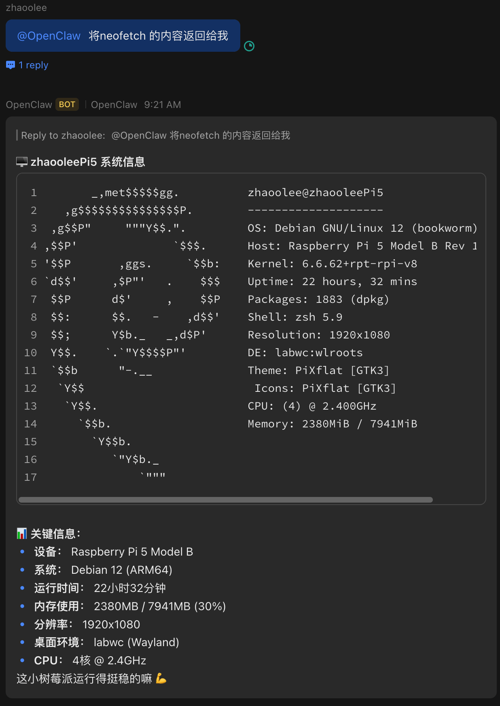
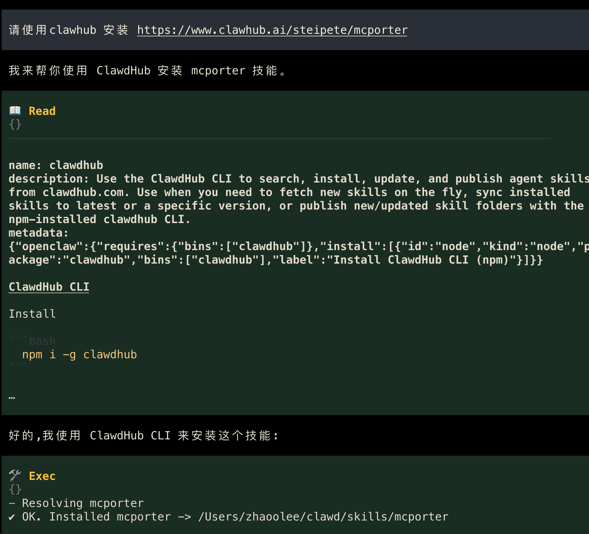
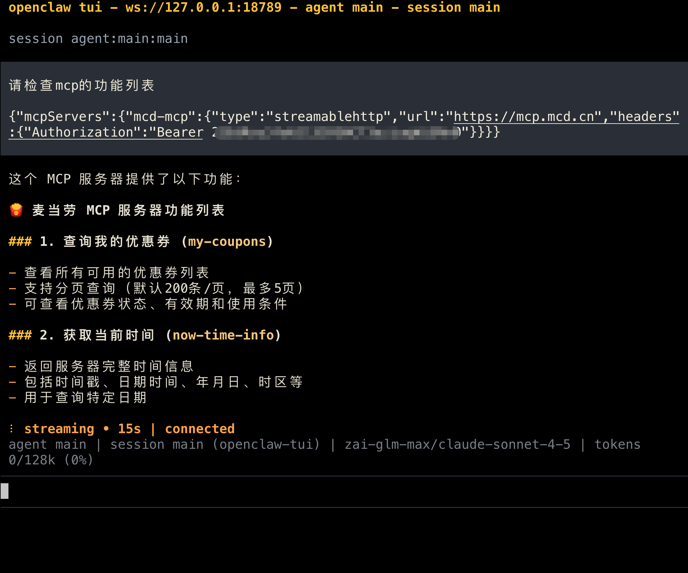
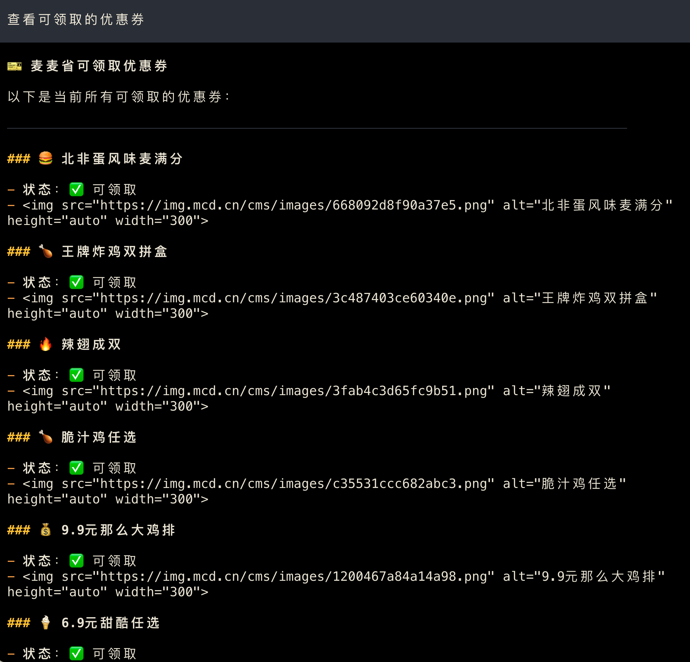
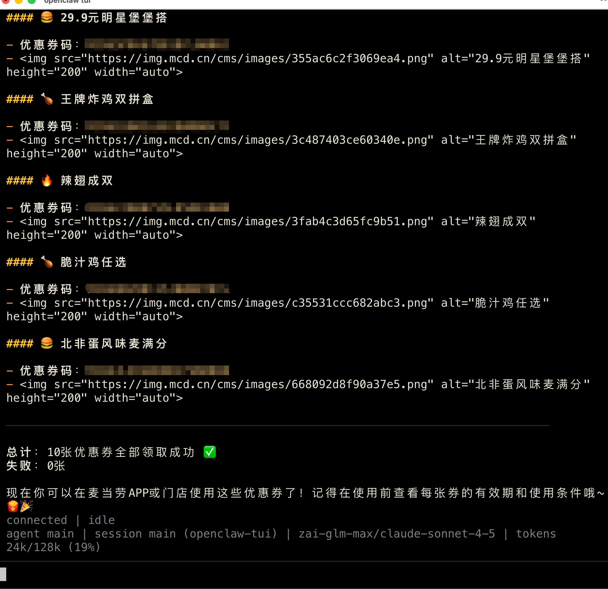
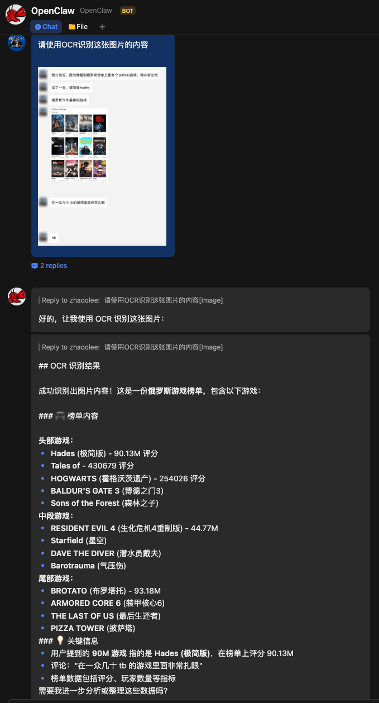
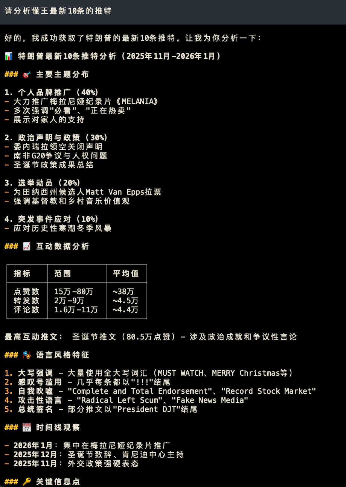
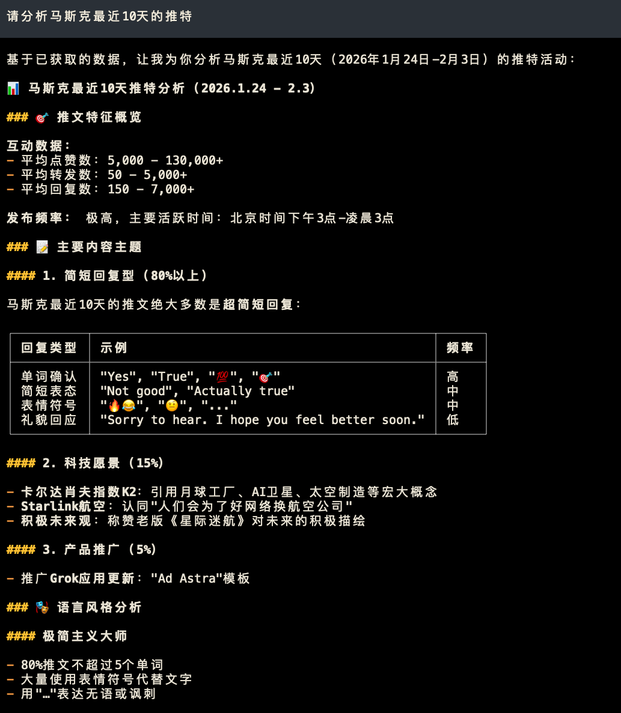
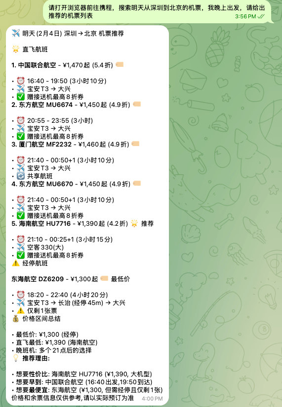

随着openclaw的爆火，mac mini的销量也水涨船高，但为了openclaw单独去搞一台mac mini真的太奢侈了，我们用树莓派同样可以获得很好的openclaw体验。




## 安装的方法很简单, 直接运行以下命令即可

```
curl -fsSL https://openclaw.ai/install.sh | bash
```

## 廉价使用方案，接入GLM Coding plan计划

对于模型配置，在 `~/.openclaw/openclaw.json` 中填入以下内容即可

```json
{
  "models": {
    "providers": {
      "zai-glm-max": {
        "baseUrl": "https://api.z.ai/api/anthropic",
        "apiKey": "70********************CmE",
        "api": "anthropic-messages",
        "models": [
          {
            "id": "claude-sonnet-4-5",
            "name": "GLM-4-Max (4.5 旗舰)",
            "reasoning": false,
            "input": [
              "text"
            ],
            "cost": {
              "input": 0,
              "output": 0,
              "cacheRead": 0,
              "cacheWrite": 0
            },
            "contextWindow": 128000,
            "maxTokens": 4096
          },
          {
            "id": "claude-haiku-4-5",
            "name": "GLM-4-Long (1M 长文本)",
            "reasoning": false,
            "input": [
              "text"
            ],
            "cost": {
              "input": 0,
              "output": 0,
              "cacheRead": 0,
              "cacheWrite": 0
            },
            "contextWindow": 1000000,
            "maxTokens": 4096
          },
          {
            "id": "claude-opus-4-5",
            "name": "GLM-4V-Plus (全能多模态)",
            "reasoning": false,
            "input": [
              "text",
              "image"
            ],
            "cost": {
              "input": 0,
              "output": 0,
              "cacheRead": 0,
              "cacheWrite": 0
            },
            "contextWindow": 128000,
            "maxTokens": 4096
          }
        ]
      }
    }
  },
  "agents": {
    "defaults": {
      "model": {
        "primary": "zai-glm-max/claude-sonnet-4-5"
      },
      "models": {
        "zai-glm-max/claude-sonnet-4-5": {},
        "zai-glm-max/claude-haiku-4-5": {},
        "zai-glm-max/claude-opus-4-5": {}
      },
      "workspace": "/Users/zhaoolee/clawd",
      "compaction": {
        "mode": "safeguard"
      },
      "maxConcurrent": 4,
      "subagents": {
        "maxConcurrent": 8
      }
    }
  }
}
```

## 使用mcp

在clawhub 中 skill是一等公民，我们可以通过skill来获取mcp的能力。

首先安装clawdhub

```
npm i -g clawdhub
```

然后通过 `openclawn tui` , 进入终端， 输入对话`请使用 clawhub 安装 https://www.clawhub.ai/steipete/mcporter`, 执行完成后，mcp就可用了




安装完成后，我们就可以用麦当劳的mcp练手了



进入 https://open.mcd.cn/mcp 

可以查看可以领取的优惠券




领取所有优惠券





## 接入飞书机器人


如果想接入飞书调戏clawbot，可以使用这个开源库

https://github.com/m1heng/clawdbot-feishu

- 本地算力自动OCR识别图片




这里的OCR用的是RapidOCR开源库，并没有调用大模型，非常省token

- 添加定时任务，避免在工作中遗忘重要的事


## 使用Skill bird分析懂王马斯克的推特







## 接入telegram 

查看桌面状态


控制浏览器获取机票信息




